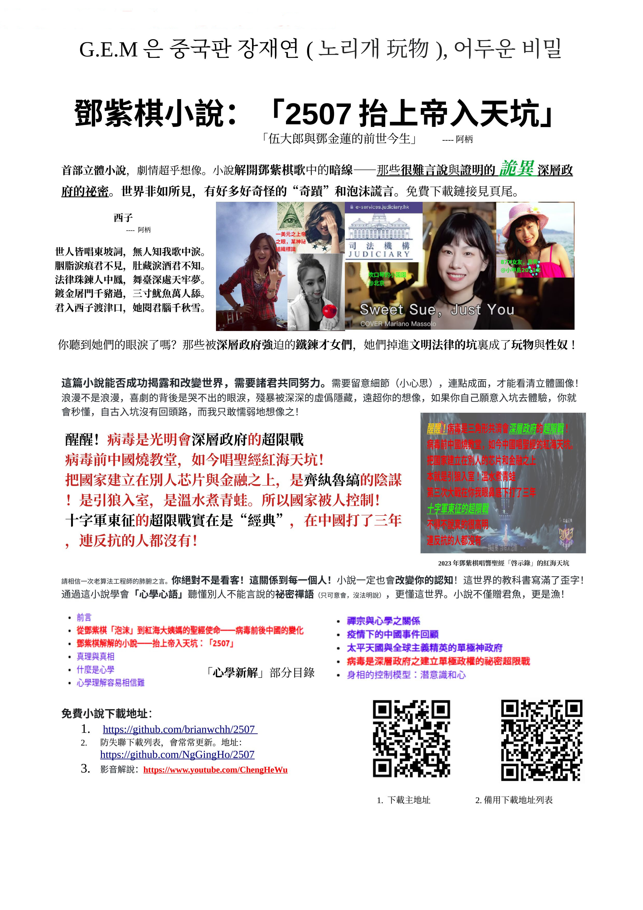

***
*我所分享之文章及程序等等皆免費，無版權，歡迎如實轉載與分享，只須標明出處即可！感恩同行有你！* 
****
- [跳轉到博客目錄頁面](../tableOfContent.md)<---[在線閱讀]&nbsp;&nbsp; &nbsp; &nbsp; &nbsp; &nbsp; &nbsp; &nbsp; &nbsp; &nbsp;&nbsp; &nbsp;   [本地] --->[*_點擊此查看html網頁格式_*](../tableOfContent.html)&nbsp; &nbsp; [*_pdf格式_*](../tableOfContent.md.pdf)
****

### 
特別推薦文章

- [ 鄧紫棋解解的小說——2507抬上帝入天坑 https://github.com/brianwchh/2507 ](https://github.com/brianwchh/worldofheart_v2/blob/main/md_and_html/%E9%84%A7%E7%B4%AB%E6%A3%8B%E8%A7%A3%E8%A7%A3%E7%9A%84%E5%B0%8F%E8%AA%AA%E2%80%94%E2%80%942507%E6%8A%AC%E4%B8%8A%E5%B8%9D%E5%85%A5%E5%A4%A9%E5%9D%91.md)<---[點擊此前往github在線閱讀]&nbsp;&nbsp;  [本地] --->[*_點擊此查看html網頁格式_*](../md_and_html/鄧紫棋解解的小說——2507抬上帝入天坑.html)&nbsp; &nbsp; [*_pdf格式_*](../md_and_html/鄧紫棋解解的小說——2507抬上帝入天坑.md.pdf) 

- [ 心學心解 ](https://github.com/brianwchh/worldofheart_v2/blob/main/md_and_html/%E5%BF%83%E5%AD%B8%E6%96%B0%E8%A7%A3.md)<---[點擊此前往github在線閱讀]&nbsp;&nbsp; &nbsp;    [本地] --->[*_點擊此查看html網頁格式_*](../心學新解.html)&nbsp; &nbsp; [*_pdf格式_*](../心學新解.md.pdf) 

- [無眠月照無情門 . 失去自由的歌手](https://github.com/brianwchh/worldofheart_v2/blob/main/md_and_html/%E7%84%A1%E7%9C%A0%E6%9C%88%E7%85%A7%E7%84%A1%E6%83%85%E9%96%80.md) <---[點擊此前往github在線閱讀] &nbsp;&nbsp;&nbsp;&nbsp;&nbsp;&nbsp;&nbsp;&nbsp; 本地模式---> &nbsp;[html網頁版](../md_and_html/無眠月照無情門.html) &nbsp;&nbsp;&nbsp; [pdf版本](../md_and_html/無眠月照無情門.md.pdf) 

    
&nbsp; &nbsp; &nbsp; &nbsp; &nbsp; &nbsp; &nbsp; &nbsp; &nbsp; &nbsp; &nbsp; &nbsp; 西子  世人皆唱東坡詞，無人知我歌中淚。 胭脂淚痕君不見，肚藏淚酒君不知。 法律珠鍊人中鳳，舞臺深處天牢夢。 鍍金屠門千豬過，三寸魷魚萬人舔。 君入西子渡津口，她閱君腦千秋雪。

    
- [心世界(world of heart)](https://github.com/brianwchh/worldofheart_v2) <---[點擊此前往github在線閱讀]  https://github.com/brianwchh/worldofheart_v2 

   

****

---

 

#  **
2507       抬上帝入天坑     
**

 作者： 阿柄，2023年1月6日，於韓國濟州島 

  

 
  

#### **人生如四一，笑里涵着淚。    真水無香，至柔至剛。** 

  

 本故事純屬虛構！如有雷同，  純屬巧合！鄙人無讀腦超能力！
 

<!-- image area, flex to make it center,it may not work for github, for html and pdf rendering only -->

 <!-- pictureWrapper_div add this only to make the bendan github understand -->
    

    

    <image class="FlexImage"   src='./images/神坑.png'/>
    

    

 ***鄧紫棋唱響中國的紅海天坑***  

 <!-- end pictureWrapper_div --> 

 

  

 **你聽到她們無助的眼淚了嗎！！！  那些被強迫的才女們  她們掉進坑裏變成了當代文明法律的玩物與性奴** 

    

 

# 
 **前言** 

 

>[梨花城](https://github.com/brianwchh/worldofheart_v2/blob/main/md_and_html/%E9%9B%9C%E6%96%87%E9%9A%A8%E7%AD%86/%E6%A2%A8%E8%8A%B1%E5%9F%8E.md)  隔岸思卿半邊臉，心中猶記滿城花。 灕江離人梨花雨，青山卿影親耳語。 一江杜娟啼心血，滿城亂世戴梨花。 未有青春可回首，唯有卿歌苦作舟。 渡我歲月千行淚，**來生**可是心上人？  [月語](https://github.com/brianwchh/worldofheart_v2/blob/main/md_and_html/%E9%9B%9C%E6%96%87%E9%9A%A8%E7%AD%86/%E6%9C%88%E8%AA%9E.md) 霞紅落盡浪千里，鳥兒飛去牽絲雨。 **若是月兒**藏手裏，千年佳釀千年語。 頭枕星辰臥聽曲，朝陽夕陽皆予你。

 
 

- ## 小說導讀

    > 2022年美國國會證實了UFO現象的存在，且承認人類目前的科技無法解釋這現象！很多人可能沒留意此信息的重要性！以前的慣例都是污名化爆料者，讓人覺得她/他是腦子有問題。而今有些東西似乎是想讓人知道牠們的存在了！？可能是隱藏了夠久，已經胸有成竹喫定了！這世界確實是存在很多未知與“奇蹟”。我們的認知是認知本身最大的障礙！一出生就寫滿了歪字、陳見與自負！  此小說遵循一種理科生的證明思路：低概率的偶然隨機頻頻發生時，就成了一種喚醒（wake up）的共鳴信號，是一種有“人”跟你打招呼的特殊信號！如GEM凳子棋在[get everybody moving](https://youtu.be/FUxHsgW4_wU)中唱的wake up。**因此小說里羅列了許多這樣的僞隨機的偶然巧合事件。** 牠們會教目標聽懂牠們的禪語，這樣成員很難自證或告發，比如韓國電影「玩物」原型的女明星，至死只有一個筆記本，連個錄音錄像文字書信之類的證據都沒有。反而是這些掉坑里的人，卻有一大堆自己的豔照門和法律證據在牠們手上，隨隨便便拿個別的比如商業證據，比如強姦證據，等等，都能讓被控制的人坐大牢幾十年且身敗名裂！牠們一直存在，一直在吊傀儡，卻把自己污名化成一種玩笑和陰謀論的對象，避開了聚光燈，牠們可以很安全地存在。  我知道大部分人只聽權威認證的聲音，下文中我也舉了好幾個與央視節目的一些巧合，文中有具體介紹，或許你也會有興趣瞭解下這其中的巧合之意。我和鄧紫棋的很多巧合，卻是大多超出我們自己的主觀意願。   陽謀能否戰勝陰謀，需要大家的另一種的覺醒和共同努力抗爭！  鄧紫棋與其他歌手不同之處是，她幾乎所有的歌里藏着一個跟金魚有關的祕密！只是其中的祕密，順着明線理解是泡沫的謊言，而其中埋藏的小心思暗線才是她說不出的殘酷現實。歌曲裏面藏祕密，也應該是有史以來第一人吧。  

    - ***你相信有人是帶着前世的記憶來到這個世界的嗎？***    
    - ***你相信[**「平行世界」**](https://youtu.be/JW52KtyGMBI)嗎？***  
    - ***你相信讀腦等[**「超能力」**](https://youtu.be/-7uaa_ONFo0)嗎？***   
    - ***你知道嗎？鬼（三）***(心臟受控，易梗)***其實一直和我們共同生活在這個世界！但你卻一直當其係人（二）。***   
    - ***這個世界有許多難以證明的[**「不能說的祕密」**](https://youtu.be/ZZ9G2Vh06Rg)！ [ ***「我的祕密」***鄧紫棋歌曲 ](https://youtu.be/8XcmT8-ZByA)***
    - ***我們對宇宙和生命的認識可謂少的可憐！而我們的無知、自負與傲慢卻膨脹如不知邊際的宇宙，我們是被困於自己認知的囚徒！***
    - ***學會逆向與發散思維***，如 ***“不要做情緒的奴隸”*** 不是雞湯語，而是事實！***人的情緒可以被操控！***，牠們把事實赤裸裸地擺在我們面前，我們卻不理解！這也是牠們最常用交流的方式，說A不是A，而是B，如此也是爲了避免留下證據！ 
    - **數字** 與 **諧音** ***是牠們常用的技巧！*** 這個牠們即美國傀儡總統拜登常說的"<u>they</u> gave me a list ......"之they深層政府（全球主義的天國單極政府）。

 

# 
- ## **小說簡介** 此小說又名【伍大郎與鄧金蓮的前世今生】

    這應該是有史以來第一部**立體小說**，其中有很多視頻和其他鏈接，你需要去查閱，這裏需要重點提醒的是，**<u>世界非如所見</u>**，我們以前一直只看<u>**被聰明的謊言掩蓋的明線世界**</u>， 自以爲很瞭解這個世界，無人能忽悠得我們，然而事實是我們卻是一直在<u>**自負聰明的認知中被忽悠</u>**。 這篇小說解說了其中很多<u>**小心思**</u>、<u>**細節**</u>與<u>**暗線**</u>，你需要<u>**連點成面，才能看清這個骯髒的、充滿美麗謊言的立體世界的圖像**</u>。而這小說也更像是**我人生經驗分享，贈君以魚，更是授君以漁（那些教科書無法教你的知識，那些別人無法明說的話，那些一直在試圖向你連接、而你卻沒意識到的信息 [包括大腦里的靈感圖像等等信息,以及現實中埋藏在“偶然”中的信號，就連你看新聞媒體等都可能會明白以前沒明白的信息]，學會了漁，你就能讀懂這世界之外和這世界之內的很多信息。如果這過於抽象，你可以想像一樣，如果你是機器人，你如何分辨你腦中的想法或慾望是你自發產生的，還是別人輸入的命令？不要把地外文明的程序命令理解成我們寫的程序一樣，不然你就落入了自己認知的監牢里了。理解這一點，然後再留意你每天看到和接觸到的偶然信息（事或物或人），然後連點成面，你會慢慢看到不一樣的世界！看完此小說之後，我也邀請你重新再看下2023年央視春晚的兩檔節目：「碇步橋，腚部橋的凳子舞」和「坑」，會有不一樣的收穫。）** 。 我絕對不是在誇海口說大話，只要你用心看懂了這部小說，一定會</u><u>**顛覆和修改你**</u>對世界**<u>的認知！</u>** <u>遠勝你讀幾十年書！教科書里寫滿了歪字！而我們卻是用螻蟻般卑微的生命在寫書，希望可以喚醒你迷失的心！</u>**   <u>**這也許也是我和她的存在意義之一！有些你難以相信的存在，也許只有以我和她的真實故事作爲證據，你們才會相信**</u>！**    **這篇小說能否成功揭露和改變世界，需要諸君共同努力，這不僅是體力活，更是智商與認知的挑戰！需要細膩地留意細節（小心思），連點成面，才能看清立體圖像！浪漫不是浪漫，喜劇的背後是哭不出的眼淚，殘暴被深深的虛僞隱藏，遠超你的想像，如果你自己願意入坑去體驗,你就會秒懂，自古入坑沒有回頭路，而我只敢懦弱地想像之！**   
    
    作爲資深的算法程序員，我也知大家平日都很忙！而我寫這個免費的小說，也更不是爲了賺錢！而是因爲這些信息真的很重要！而要想方設法讓更多人明白和知道更加重要！這是做人最基本的義務，就像延續物種的責任一樣。寫小說於我是一個很大的跨界挑戰，要把故事講明白、講成功更是一大挑戰！所以也請各位抱有同樣的心態和我一齊挖掘這世界你沒留意到的“奇蹟”與黑暗！    
    
    爲了讓你相信這世界有所謂的“奇蹟”，而不是我胡說八道，從一個我無法自己編的“神奇”事實開始吧。只是“神奇”不神奇，背後是黑暗的坑與無助的眼淚，後文會詳細談及。
    <!-- image area, flex to make it center,it may not work for github, for html and pdf rendering only -->
    
 <!-- pictureWrapper_div add this only to make the bendan github understand -->
    

    

    <image class="FlexImage"   src='./images/吹口琴的小園園.png'/>
    

    

     一個神形同我前女友都極相似的小才女，細緻到連酒窩都一樣？！ 這種事情發生在諸位身上的概率有幾多？這只是其中一個小概率卻能“偶然”發生在我身上的事情，後文還有更多。  

    

    >看到人臉之”巧合“，我相信你應該多少有點覺得我講的是生活中的事實，而不是胡言亂語！除了臉的巧合，再有就是**名字中的巧合與祕密！**  一開頭先給出結論，後文再細細分析且給出更多巧合，且**帶着這個結論去看小說思路也更清晰**，不容易看迷糊。我不是來賣弄文學講浪漫故事的，<u>**而是來揭露這醜陋的世界的！我已經盡自己所能來證明這一切是真的。我一個資深的算法工程師跨行不是爲了當作家！如果你是已經意識到牠們信號的人（即被牠們wake up的人），我想你可能也經歷且困惑着這相似的所謂”神蹟“，我警告你別信那些甜蜜的謊言泡沫，腳踏實地自己打拼，不要接受牠們的提供給你的甜蜜機遇，更不要獨自上牠們的車，或與牠們會面，這是一個2變3的沒有回頭路的坑！！！</u>**   深層政府（光明會或共濟會）一直在招人，看完這篇小說，你也可以會學到如何識別牠們的信號！  我很明白，神話一樣的故事居然會發生在現實生活中好像很浪漫，相信很多人都會被甜進坑里，然後才發現自己上了神話文學的當了，神話文學的背後是這個世界醜陋的血淋淋的現實！  而我的“浪漫故事”就始於這幾年發現了自己名字中的祕密！這跟鄧紫棋歌曲「我的祕密」有關，我會一一解開那些她藏在歌曲中沒法明說的信息，和多數神話一樣美的文學一樣，如果你跟着表面劇情走，你就被騙了。**如果你失去了自由，你會如何發聲？！** 當代世界，政客和明星在同樣的坑裏，你信嗎？！世界新聞的口水戰里沒有真相！但看完這篇小說，你懂了心學心語，你會看到不一樣的信息！ 如一首歌里所唱的：<u>***we don't talk anymore!***</u>   先記住兩個個我會反覆講到的結論：    &nbsp; &nbsp; &nbsp; &nbsp; &nbsp;  1.&nbsp; &nbsp; <u>你以爲的你以爲其實不是你以爲的你以爲</u>。 &nbsp; &nbsp; &nbsp; &nbsp; &nbsp; 2. &nbsp; &nbsp; <u>單個事件或事物看似偶然，但在時空的長度和高度連點成面，你會看到超出你意志的安排，包括第1條，即你以爲的你你以爲其實不是你以爲的你以爲！每一件看似偶然的偶然都有其我們理解不來的安排！這個後面會慢慢用事實證明！我不講玄學，我相信大道至明，我能理解的，相信比我聰明的你更能理解，我是在用理工科學生和工程師的思路來證明給你看。我更不是來讓你信神，相反，我是來揭露和勸你不要掉進天坑里，那可是[**「單行的軌道」**](https://youtu.be/rwrYO8S1wX4)，沒有回頭路！這世界也沒你知道的那麼安全！</u>  <u>鄧紫棋</u>被業界稱爲<u>解解  姐姐之諧音，又是諧音梗</u>，和張國榮稱爲哥哥一樣，應是一種同行給的昵稱，原名叫鄧詩穎，我原名叫<u>伍金和（荷）</u>，1983年3月2日生，金魚座，我有個小時候掉河裏離開的姐姐叫<u>伍蓮金</u>，我倆都是農曆正月18生。荷即是蓮，所以荷花就是蓮花，我爸爸給我取這個名字應是出於心中的愧疚，我是在我姐姐離開幾年後出生的，金荷即是金蓮，我姐名字就是倒個過來反着的金蓮。乍看是不是和鄧詩穎沒有聯繫？這裏**用說文解字來解穎字：穎，禾葉之尖尖，禾通荷，荷葉之尖尖，即荷花，即蓮花。 鄧紫棋多次暗示她是金蓮**，這個後文中會詳細講解她視頻中傳遞的信息，比如她常開玩笑說她男朋友叫餅，中國人都知道武大郎燒餅與潘金蓮啦，她也展示少有人會的**蓮花舌視頻**你網上搜一下，很多相關的照片和視頻，也曾以**金花**之名宣傳國語後文有圖片和視頻，金花應是金蓮花之意，她也一直說她鄧紫棋是**凳子妻**，凳子即矮子，世界上最有名的矮子還是大名鼎鼎的武大郎啦，我因爲姓伍之故，有大學同學昵稱我爲**伍大（郎）**，我曾爲此懊惱過，但別人的偶然行爲卻是一種他不知道的安排，像是一種信號與提醒！倒不是說我是真的武大郎再世，而是安排我能讀懂一些我能共鳴的信號！如果是你，這麼多巧合發生在你身上，你會不會被wake up而留意這些奇怪的巧合信號！這就是共鳴，也是牠們希望你這麼共鳴的，這樣牠們才能開始和你建立起特殊的通信管道！這些巧合跟上面展示的我前女友與某失去自由的小才女（吹口琴的小園園）的巧合，是不是有點巧合的不大正常，這樣的巧合多了，就成了一種**只有你能共鳴的信號，但要證明之卻容易被嘲笑成神經病**！(神級的圈套是不是很高級？！，又能忽悠人，又極保密！）。好在我是個資深的算法工程師，不是街上裸奔的瘋子，說話還算正常，而且我相信自己有足夠的證據來讓你們相信！我就冒着被嘲笑成瘋子的“風險”來挑戰一次！且先不說別的，這還是一個蠻有可讀性的故事，一般的作家還編不出這樣的故事！如果你真不信這是事實，我也真沒辦法了，你就權當是看故事吧。你如是導演或是編劇，歡迎你在這之上發揮你的聰明才智，盡情改編，無須任何版權費！  名字的祕密還沒完。說完鄧詩穎本名，再來說說鄧紫棋這藝名。她的歌曲和vlog（視頻日誌）即是她所說的飄流瓶，有一個視頻日誌里，她曾“無意中”展示了她的學生證或是身份證之類的，上面寫着鄧詩穎。而她藝名鄧紫棋，關注過她的人都知道她常常說自己是騎着凳子的棋或妻，我爸爸的名字叫伍其昌，2012年已過世，是村裏的木匠，乳名叫柏公，即客家人里常常拜的土地公公，因爲土地公公的像都很矮，就是我爺爺說他矮的意思，哈哈，我老爹這親爹也是個好爹。鄧紫棋也有暗示過她是木匠（後文會分析），也即鄧紫棋是矮子木(匠)其的意思。然後她又很"巧合"地拍有花木蘭的視頻，意思是她（金蓮，睡公主）是替（土地神/天）來的，別忘了，她是基督徒，就是那個千年笑話的缺爹教，客家人***洪秀全***被他爹天父忽悠了，搞了個聲勢浩大的太平天國運動。  穿插點洪缺爹，洪秀全的笑話。洪秀全不是其本名，是後來他自己爲了舉事改的，“秀全”拆開就是“禾乃人王”之意，即說“他是人王”的意思。太平天國里王特別多，有管東方的王，還有西方的王，就差沒有地球之外領土的王了。歷史書上把他說成是一個英雄，現在再看，就是一個笑話！至今花都還保留着這笑話的遺址，當成是一直驕傲的文物或歷史。2010年因爲一段異地戀，返於花都時自己還曾遊覽過。只是與那位花都的花姑娘的戀情卻是大大的短。  如果你瞭解過天國政府的宗旨，你就會知道，牠們現在就是全球主義者，掌控着世界的金融，溫水煮青蛙一樣控制着世界的每一個角落，牠們的最終目的是全球單一天國神政府，你看看現在全球主義者做的事情就知道我沒胡說。缺爹的基督教里有個千年的笑話人物——不亞於武大郎的耶穌，他老爹是木匠，據說是老爹沒和老媽行房就出生了，然後說自己是神的兒子！這麼多名字的"巧合"，聰明的你應該看出來這裏的笑話梗是什麼了吧！這麼多的“巧合”絕不是巧合，我如果相信這是巧合，而不反思自己對這個世界的認知，那我就腦子不正常了，但如果我信了這笑話，那腦子更不正常了！牠們既然送我一個坑，自然也送給了我一些證據，至於誰把誰埋進坑里，就需要各位聰明的你幫忙了！你可以把我當成笑話，<u>*但如果你看完這篇小說還把牠們當成是笑話一樣存在，你就是真該反思下自己的認知了，牠們就是把祕密藏在笑話里，你們越不相信牠們的存在，牠們越安全！而且牠們也是千方百計不讓知情者能證明牠們的存在！事以密成、悶聲發大財、把傀儡放在前臺是牠們的慣用伎倆！*</u>  <u>*這種躲藏在屎坑里的詭異存在，除了難以被人證明其存在外，還特別喜歡潛伏，往往是你搭臺，牠們唱歪戲*</u>。最典型的例子就是釋迦牟尼了，佛學本是修心的，釋迦牟尼說衆生皆有佛性，佛即是覺醒的人類，而不是神，然而，等他死後，魔鬼就把他造成了佛教的神！佛學是無神論者，而魔鬼卻混入佛教中唱歪戲！等於說釋迦牟尼的所有努力都成了給這些深層的東西做了嫁衣！凡是有神的，都是坑，神不是神！人和自然一直處於抗戰當中，自然即是神的領域，唯有心是人的領域，即佛（覺醒者，你可以去網上查佛，如來其梵文本意）的領域。智善才是佛！中國歷史上曾佛教盛行！記住是佛教，不是佛學！神都是特別甜，如太平天國的均田制度，神都特別會團結勞苦大衆，一邊送雪，一邊送碳。**中國歷史上幾次比較開明的皇帝滅佛運動之後，都是暴病離奇身亡！有沒有點像是林肯和肯尼迪家族的遭遇！你可以想像牠們潛伏的有多深！** 天國計劃的溫水煮青蛙一直還在緩慢推進！以屎爲鏡可以知興衰，稍微瞭解下太平天國的歷史，與太平天國的去中國傳統的節日，比如爺降日，即可知“爺”曾經來過的痕跡，這個“爺”不是傳說中的不存在，只是這個“爺”喜歡藏在屎坑里把中國和世界搞得跟糞坑一樣臭。真正的儒家是文化修心教化人，不僅行爲舉止要有禮儀，以區別於禽獸與野蠻，更重要的是修心，可以說修心齊家平天下就是儒學的精髓了！幸好儒家不是神學，要不然畜生連孔子都要鑽入了，把他造成和釋迦牟尼一樣的神來拜了！  人的大腦一直以來都是心和神/魔的戰場！ 

     

    這裏尋找線索可能要花點小心思。故事是當代版本的伍小郎與金蓮（花）的前世今生！巧合始於**鄧紫棋**的*本名與藝名*，故事貫穿於音樂。這些<u>**非我們主觀**</u>的<u>**很多巧合**</u>，剛好是某些<u>**難以證明之存在**</u>的證據，也希望通過我們的故事，讓你們看清這個真實的世界——世界非如所見！建議先看完心學心解並瞭解**心學心語/禪語。** 看完[「心學心解」](https://github.com/brianwchh/worldofheart_v2/blob/main/md_and_html/%E5%BF%83%E5%AD%B8%E6%96%B0%E8%A7%A3.md)，再看此小說，會更容易理解，也更能看懂人間笑話！在一個“自由”的社會里還需要講禪語，你大概也可感覺出人類是一種怎樣的真實存在了。然後你再去聽**鄧紫棋解解**的所有歌曲，而我也會逐一講解她歌曲中的暗線，把這些點連接起來就更有立體人間畫面了。 **感恩這個世界有你！**

     

    

    [心学新解 ](https://github.com/brianwchh/worldofheart_v2/blob/main/md_and_html/%E5%BF%83%E5%AD%B8%E6%96%B0%E8%A7%A3.md)<---[點擊此前往github在線閱讀]&nbsp;&nbsp;  本地模式 --->&nbsp;[html網頁版](../md_and_html/心學新解.html) &nbsp;&nbsp;&nbsp; [pdf版本](../md_and_html/心學新解.md.pdf) 

    

    > **心學心語/禪語** *爲何重要？* &nbsp; &nbsp; &nbsp; &nbsp; *這篇小說不僅授人與魚，更是授人與漁！此後你會更容易看懂這世界的信息！只有大家齊心協力，陽謀才能戰勝詭詐虛僞的陰謀！*

     

     寫這篇小說，我深知面臨**兩大難題！** 第一個是**如何證明且讓人相信這個難以證明其存在的、卻控制着世界資源的詭異深層政府的存在**！第二個是如何**突破封鎖**把重要信息送至大多數人碗裏！  

     

    [**病毒是深層政府之建立單極政權的祕密超限戰**全世界的青蛙都還在溫水中睡着](https://github.com/brianwchh/worldofheart_v2/blob/main/md_and_html/%E5%BF%83%E5%AD%B8%E6%96%B0%E8%A7%A3.md#病毒是深層政府之建立單極政權的祕密超限戰)，「2507」這篇小說能幫你揭開這個像鬼一樣存在的神祕深層政府的面紗！也看看這亦真亦幻世界真實奇蹟的存在！

     

    西方某缺爹教的、神選之民的、祕密掌控世界金融的神祕家族曾言：一個國家，只要控制了其印鈔機，對牠們而言，不管什麼政體都不重要！ 

     

     **一個國家的建設若依賴於別人的芯片與金融，無異於把國家送人！芯片同糧食一樣，可以間接轉化成金融，而金融可以收買政客！從而成爲了萬年的看不見的慈禧！**  

     

     <u>如何證明這 **「難以證明的、如鬼一樣存在的、且卻控制着世界的、以三角形和一隻眼爲符號的」**  ***深層詭異政府***的存在！！！？？？</u> 川普喊過，多數人不信，卻更相信主流媒體說的川普形象，最後川普自己被趕了下臺！還陷入了召集公衆叛亂的官司中，他可謂是官司不斷！在控制着全球資源的“三”眼裏，牠們可以用各種手段來消耗你！公衆膜拜的權力頂峯人物如政客和商業巨子，在“三”眼裏不過是牠們放在前臺的傀儡！他們幾百年來，以「事以祕成，以猶太人的複利模式」一點一點地、以水煮青蛙的方式祕密推進牠們全球主義的單極神(天國)政府！

    >  天國政府主義忽悠人的理論基礎之一是：人與人之間互相不服誰，所以才會有爭執和戰爭！ 

    等到衛星佈滿地球，徹底腦控全人類的時候，也許就是牠們放下僞裝和僞善的時候了！牠們早已引領着教育、文化、時尚、和人類羣體的認知幾百年之久，卻比慈禧更精明，能躲過牠們自己控制的主流媒體的聚光燈！你只聽過牠們的傳說！卻沒法親眼看見！更別說證明其存在！**知道牠們祕密的人大多已掉進法律和各種坑裏，出於各種原因，被控制的他們無法明說，即使說出來了，也缺少足夠的證據來證明！相反地，大多數嘗試的人，往往成了公衆認知里的笑話和精神病！而不知道祕密的大衆，根本無法相信！因爲大多數人都被困在於被牠們灌輸給大衆的認知里，自上學起，我們的認知就是牠們教的！偶然突破認知的機緣巧合之人卻是極少數。** 

     結合我自己的覺醒過程，我只有、也只能以 **「多數微小概率事件的疊加等於人爲安排」** 的思路來證明牠的存在！ 這個很好理解，太多本不大可能發生的巧合概率**總是**發生在你身上，你肯定也會覺得這世界有點蹊蹺了！

     作爲當局者，我自己花了近三年時間才徹底相信！以下是我簡要的經歷，更詳細見後面「2507」的小說。   5年前(2018-2019)在新加坡NCS（Singtel新加坡電信旗下子公司）上班，(至於我怎麼會有機會到這間公司，且先不談！)。

    <!-- image area, flex to make it center,it may not work for github, for html and pdf rendering only -->
    
 <!-- pictureWrapper_div add this only to make the bendan github understand -->
    

    

    <image class="FlexImage"   src='./images/新年願望.png'/>
    

    

     [讓會撒嬌的獅子座解解幫你實現**一杯子**的願望](https://youtu.be/1vk59z97cmM) : 漁民起牀啦！  

    
 <!-- end pictureWrapper_div --> 

     

    <!-- image area, flex to make it center,it may not work for github, for html and pdf rendering only -->
    
 <!-- pictureWrapper_div add this only to make the bendan github understand -->
        

        

        <image class="FlexImage"   src='./images/魚尾獅.png'/>
        

        

     新加坡魚尾獅：**獅子做的美人魚** 。<u>紫色的巧合</u>。  據設計者的創意介紹，魚尾獅是一種虛構的存在，以前新加坡是漁村，魚尾獅意海的保護神。客家人因其各地遷徙，大家常拜柏公，即土地公公，所以很多客家村落一些樹下常見小的柏公神龕！村裏也有大的柏公廟！遷徙到沿海的客家先民，也因此有人用柏公來代海的保護神，祈願出海平安！<u>*只是**獅子做的美人魚**爲何會是天公(9)地母(6)之柏公土地神，詳見後文分解。* </u>  

    
 <!-- end pictureWrapper_div -->

     

    那陣子，網上有位若女子，網名叫墨緣若氏，意黑土的玫瑰(rose)，又或是墨顏玫瑰，就如趙本山與宋丹丹的笑話「白雲與黑土」。

    
  
        
    太過份了 **183**    合理的理解   你捉住了周公   捕獲了整個春夏秋冬的新娘  . 若  

    

    在韓國濟州島期間**她一直暗示我上車和她見面，當然我沒聽她的話。**   她寫現代詩挺有特色的，一直在暗示她是我過世的伍蓮金姐，即我家排行第二的那位姐姐(小時候不慎掉進村裏的河里走了），又提示我失憶，我全當是某種高級水軍惡搞！當時我也納悶，這麼好的文筆，怎麼會當水軍呢！？我又不是什麼重要人物，用不着派這麼高級的水軍來網上追蹤我吧，我沒當回事，只是權當是跟她學學文學了，若我文筆有點點進步，那也是跟她學的。至於她爲何如此神通廣大知道我以前叫伍金和，就跟我那會一直失眠一樣神祕，我也沒多大去細究，我又奈何不了"他們"。不過我倒是慢慢開竅了："和"通"荷"，荷花即是蓮花，那金和，就是金荷，就是金蓮。那我不就是我蓮金姐姐的鏡像了，她是女，我是男，她去我來，說不定我就是她，她就是我咯。至此，也只當是個神話般的巧合！權當是用文學眼光來看生活！若她真能帶着記憶以另一個女子身份回來，那真是人間奇蹟了！但這在自己以前的認知裏面怎麼會相信呢！我又沒瘋！況且網絡的世界亂七八糟魚龍混雜，豈能隨便信這個位養狗的若女子，且簡稱其爲**若狗**或**狗若**吧！:) 。起初我以爲若是黑客，於是我慢慢改爲在紙質筆記本上寫日記和其他，但她依然有超能力一樣可以知道，且知我所想，只是這些我無法證明，權當是我主觀臆測。直到2022年下半年鄧紫棋刪除其instagram之前所有記錄，並簽約了一家外國公司。她這操作讓我很費解！明星怎麼會隨便刪除幫助其宣傳的社交媒體資料呢！況且2018年她同前東家打官司才跳出經紀公司的火坑，怎麼又跳進去了，這遭遇跟我瞭解到的那個123的新生代蔡佩軒好類似，於是才去查看鄧紫棋以前所有的歌曲，並發現她和其他歌手不同，她的歌里藏着一個和金魚有關的祕密！我也才真的相信，原來這世間真有若女子！再加上自己也知道了腦控的祕密，當然深知人類被深深洗腦的認知有很多是錯誤的，世界非如我們所見所知！
    
    如果這個說普通話像宋丹丹的凳子棋，一直唱粵語歌，我這程序員可能早成了她忠實的粉絲了！我可能早就收到她的網絡飄流瓶了，這飄流瓶即她的音樂，里面藏着很多小心思！如果早點收到她的飄流瓶，我也可能早就信了！
    
    **概率稀少的巧合太多了，就足以證明一切了！**

     至於能否將重要信息送到更多人碗裏，我只能盡人事聽天命了！努力過了，儘管不完美，我也就對得起良心了，而且我又不是聖人神人，甚至連賢人都不是。 

     

- ## **甜美的套中套模式** 

    

     **神的陷阱**   神的陷阱都如姜太公釣魚，  圈中有圈，套中套， <u>**魚餌是我們自己以爲的智商破解的信息!!!!!!!!!**</u>   你所發現的祕密，非你所發現。 **你以爲的你以爲其實不是你以爲的你以爲！**  白的背後可能是黑，黑的背後，也許是無奈！    雪中送炭，雪中情，磕頭感恩梁山行。 卻不知，送雪送炭者乃是同一人   月亮很美，  但一定要觀其背面，  才不會只緣身在此山中！ ***___  &nbsp; 。 ___***   

    

    #

    

     **
 甜美的陷阱 
**  有一種陷阱 甜進心裡 暖化冰心 進入的時候 陶醉得像是 天下最俊美 最幸福的男子  想出來的時候 才發現 卡住了命根 像極了一隻狗    ***___  &nbsp; 。 ___***     二變三的過程 

    

    # 
    
    

     **
 賞月的心 
** 一輪古月詩千篇 多少甜蜜的相思 灑落了人間 多少悽美的神話 伴隨着童年  而今  隨着年歲的增長 賞月的心 不再只看其皎潔如雪 想到的更多是其 背後難言的滄桑 &nbsp; 與  黑暗   ***___  &nbsp; 。 ___***     ****曉心思****&nbsp; &nbsp; &nbsp;    遠方有佳人， 殤心撫與琴。 ****曲曲弦外音****， 句句相思雨。  時空漣漪語，     阿哥可知矣？ 
 

    

    #  

    

    **
 世間若女子 
**   人是天生不完整的靈魂 我們於迷惘中 或等待 或尋覓 這世間若女子  她如生命的鑰匙  開啓你的心門 &nbsp; 讓你  望穿世間風雨 看懂人間情愛   這世間若女子   因爲她的眼淚  或澀 &nbsp; 或苦 &nbsp; 或甜 於是你的世界 有了多情 有了  七色彩虹  ***___  &nbsp; 。 ___***  

    

     

- ## **2507的來源**

    <!-- image area, flex to make it center,it may not work for github, for html and pdf rendering only -->
    
 <!-- pictureWrapper_div add this only to make the bendan github understand -->
    

    

    <image class="FlexImage"   src='./images/Gem2016.jpg'/>
    

    

    
  鄧紫棋25專輯封面，喫了七彩蘋果（泡沫）的小女生，  某角色的演員，世界非如所見所聞!  
 
    
 <!-- end pictureWrapper_div -->

     

    2507是我的家門號。房子購置於2012年，位於大亞灣。  

    因自己親身經歷過中國人爲房瘋狂的事情，寫下了幾行有關2507的文字： 

    

      

     **2507** 

    大亞灣有座墳  
    碑上有行字  
    寫着他一生的全部 

        

    2507   

    ***_-----&nbsp;。-----_***

    
    2507是我在惠州大亞灣的家門號 今已遭拍賣  世間變故果然 [**「防不勝防」**](https://youtu.be/Jn-w4uw15-c)   

    **房不剩房**
    
    淺水啞灣花不香，     
    北燕南飛苦無聲。   
    響水河畔有孤家，   
    紅門長叩是誰開？ 

    ***_-----&nbsp;。-----_***
     
    土地，是中國人的智商！ 以前一畝三分地，栓着一家四代同堂。 如今，幾十平米的水泥地，綁着兩家三代拉磨的人！  一間間房
    猶如一座座墳墓 埋葬了幾多夢想與愛情  我們的家 其實 與房無關  只與你有關

    

    <!-- image area, flex to make it center,it may not work for github, for html and pdf rendering only -->
    
 <!-- pictureWrapper_div add this only to make the bendan github understand -->
    

    

    <image class="FlexImage"   src='./images/2507.png '/>
    

    

    
  
 
    
 <!-- end pictureWrapper_div -->

    當時只是開了個頭，本想結合自己近幾年的經歷，寫點帶着眼淚的都市男女笑話！那些現代人類債臺高築跳房坑的攀比與驕傲！

    
    而最近兩三年的經歷卻發現，25與7這兩個數字似乎與鄧紫棋有某種貌似沒有關係的偶然巧合，又好像是我的[**「人生密碼」**](https://github.com/brianwchh/worldofheart_v2/blob/main/md_and_html/%E9%99%84%E5%BA%B8%E9%A2%A8%E9%9B%85/%E4%BA%BA%E7%94%9F%E5%AF%86%E7%A2%BC.md)！詳細見後面的分析！這數字背後的祕密也顛覆了我對這個世界的認知！世界真的非如我們所見，和這無邊無際的宇宙一樣，充滿了未知！
    
    我不得不驚歎地又重複一次：你以爲的你以爲，其實不是你以爲的你以爲！**孤立事件看似隨機偶然，但在時間和空間上連點成面，你慢慢看清的是不一樣的世界！** 這種隨機的巧合多了，你應該看得出這世界有一種超出我們智慧和力量之外的安排！2507只是其中一個貌似不大明顯的巧合。

     

 

- ## **漢字藝術之鄧紫棋與鄧詩穎**[**「你的名字」**](https://youtu.be/8mgIvLVBOMc)鋼琴曲。留意這個鋼琴曲的youtube主人ET頻道。  何爲天人合一？**天書是無字無聲的，如人類給機器人發的指令，留意每個偶然事件點之間的聯繫，連點成面，想想每個起心動念或慾望背後的動機？是靈感？是陷阱？然後用心做選擇！以達所謂的天人合一！**

     此小節都只是略微提及名字里所藏着的“巧合”，更多解析和更多有意思的其他“巧合”見後文，這些“巧合”就是很甜的謊言和坑。我們的名字都是父母取的，而他們都互不認識，**事情單獨看似隨機的偶然，而在時空的高度來看，才能看出某些我們控制之外的“巧合”，你以爲的你以爲其實不是你以爲的你以爲。我一再重複這句話，就是想提醒你很重要，我舉例我前女友，我的名字，鄧紫棋的本名，都是想告訴你人與事的存在有種我們無法理解的安排，就連我們的起心動念都是非我們以爲那樣，希望你可以從現在開始留意你所想及其背後的動機，和生活中的那些“偶然”信號，你也會發現這世界之外有東西在和你通信！你的所謂的靈感可能不是你自己所想，而是一種無名的賜予！至於那是坑還是禮物，自己用心做判斷和選擇！即天人合一，同時也別忘了“天若有情天亦老”是什麼意思！**  
    
    鄧紫棋常自我戲稱凳子棋，意矮子木匠其。而我爸爸名字叫伍其昌，是村裏的木匠，和我一樣身材比較矮，166cm左右。鄧紫棋與伍其昌之間的聯繫後面會詳細解析，不是她想佔我便宜，而是想引起我的注意，即wake up，然後傳遞更多更深層的卻不能言傳的信息！看完後面就會更清楚了！    棋本名詩穎。穎，禾頁之尖尖，頁頭也，字意：禾末。而禾頁諧音荷葉，荷葉之尖尖爲荷花，即蓮花，[**金蓮(花）**](https://youtu.be/5spgQDG6f1s) 。 而我家裏有個姐姐叫**伍連金**，而鄧紫棋也有個外號叫**解解**（與姐姐同音，就像張國榮有個外號叫**哥哥**一樣）。然後鄧紫棋拍了個MV是跟**花木蘭**替父從軍的故事有關，同時又有個角色叫**武則天**，即像武則天的花木蘭，而武與伍同音。    

    連點成面，<u>***此處的坑**就是她（鄧詩穎）是我已故姐姐伍蓮金穿越回來的，替我已故的爸爸帶信息來了。記住她是基督徒，基督教里有個千年的笑話叫耶穌，木匠的兒子，而且全世界都知道是他媽媽沒有和他爸爸木匠同房就能神奇懷孕的。他爸爸奇蹟一樣的綠帽也是千年之謎！於是這個木匠的“兒子”就到處不要臉地去世界各地傳教自稱是“神之子”！再加上 **「大魚海棠」** 那部感人尿下的電影，影射女媧與她哥哥或弟弟的亂倫故事，然後又有那個 **「黑客帝國」** 的洗腦神劇，這些信息“他們”通過各種渠道，不厭其煩地給我洗腦，然後就是常常以各種方式暗示我自願上車！牠們想讓我相信自己是那個神經病 **救世主耶穌**，哈哈哈哈哈哈哈哈哈哈哈哈......！*</u>

      另外還有**坑中坑**，<u>鄧紫棋多次在視頻中暗示10這個數字（比如「十年」的音樂，還有什麼相戀十年啊，如此等等），即5.14（5+1+4=10，記住牠們這種變態的數字遊戲，不然讀不懂深層政府的信息。)，即那個神形酷似我87年生的前女友的才女，名叫陳方園，即天圓地方的那位，眼睛很漂亮，髮型也和「大魚海棠」里的椿一樣，也是福建人，貌似也是客家人，福建武夷山的。</u>  

    **帶着上面的兩個結論再看下文比較不會迷失**。接下來就是詳細講解牠們是如何讓我相信上面的結論的。**重點始終是如何合你們之力，讓陽謀戰勝陰謀，把牠們埋進牠們自己挖的坑裏，牠們的軟肋是見不得光的祕密！而我們是不怕曬太陽的！我們面對的是一小部分智商很高且陰險詭詐的東西！要成功地粉碎牠們的陰謀，我們必須首先謙虛地承認自己的不足，然後智商上要努力和團結！牠們的陰謀能得逞，就是因爲牠們利用了我們的私慾（只要不是窮兇極惡，人正因爲不完美的瑕疵所以才美、才可愛，一種矛盾的美，所以人生才是一種有意思的修行，如果個個都是仙了，還來人間幹嘛？！），然後我們一步步喫下了牠們的蘋果和魚餌，以至於落得一手材料在牠們手上，被牠們擺佈和控制。而你要去舉證牠們，卻總是像啞巴喫黃蓮一樣！不僅說不出，即使說出來了還沒人信！**

     

    <!-- image area, flex to make it center,it may not work for github, for html and pdf rendering only -->
    
 <!-- pictureWrapper_div add this only to make the bendan github understand -->
    

    

    <image class="FlexImage"   src='./images/金花.png '/>
    

    

     鄧紫棋9歲時以 **金花**（**與金蓮花巧合**） 之名在香港某電視臺推廣胡言亂語之”國語“！說起所謂的“國語”，心裏就想起歷史的警言：胡言亂語！又有多少人真正理解這我們掛在嘴邊的四個字說的是一段中國歷史與所謂國語的來歷！真的是鬼老天給中國人開的一個大玩笑！赤裸裸的事實擺在面前，而一些所謂的學者叫獸居然還像考古一樣寫文章探究“普通話”的來源！胡言亂語的四聲調不通漢字的陰陽四韻，更是到處亂用漢字，如“上午”應爲“上晝”，不懂漢字的胡言亂語在教說正宗漢語的粵語和客家話講“普通話”？！你當漢語只是買菜的語言？美國是把手放在笑話書「聖經」的泡沫之上的，而 **中國是建立在漢字之上的！  中國之所以幾百上千年動盪且人心飄浮不安，是因爲被胡言亂語了，沒有學懂和保衛好漢語！ 漢語文化修心，治百病！** 不管你心理多變態，都能治！ <u>學好科技，喫喝變好。而學好漢語，人生更上一層樓，更窮千里目！修心知足快樂多！</u> 但保護漢文化又必須要有高科技的戰馬！方不會重蹈覆轍！  

    
 <!-- end pictureWrapper_div -->

    <!-- image area, flex to make it center,it may not work for github, for html and pdf rendering only -->
    
 <!-- pictureWrapper_div add this only to make the bendan github understand -->
    

    

    <image class="FlexImage"   src='./images/棋.png '/>
    

    

     **凳子棋說木匠是醉翁之意**的巧合，見後文分析  

    
 <!-- end pictureWrapper_div -->

 

- ## **世界非如所見，歷史有明線與暗線。** 

    >  如果你沒看小說就認同，說明你也是到了一定年紀，知了些本不該被知的東西。    2022年下半年偶然機遇關注鄧紫棋以前的音樂，連點成面，**方知她所有的音樂里藏着一個 <u>和金魚有關的祕密</u>！** 正如她所言，她作音樂不是爲追求好聽和娛樂！**而是希望大家從她音樂中得到一些信息！** 但她卻還是依然能把嬉笑怒罵寫成相當好聽的音樂。  **失去自由的她！！！音樂講的是明線，有些話需要有密鑰方能解開。我這裏講暗線！**    **失去自由的她！！！音樂講的是明線，有些話需要有密鑰方能解開。我這裏講暗線！**    **失去自由的她！！！音樂講的是明線，有些話需要有密鑰方能解開。我這裏講暗線！** 

    <!-- image area, flex to make it center,it may not work for github, for html and pdf rendering only -->
    
 <!-- pictureWrapper_div add this only to make the bendan github understand -->
    

    

    <image class="FlexImage"   src='./images/dzq.png'/>
    

    

     **鄧紫棋**,[**「it is good to be bad (bad諧音back)，回來真好！#活着真好」金魚臉鋼琴版本https://youtu.be/Nsi1EB2HxvE**](https://youtu.be/Nsi1EB2HxvE) 

     **嘴巴一邊是魚，一邊是人，意指：獅子座的半人半魚 = 獅子座的美人魚**，獅子做的美人魚，和新加坡的那個魚尾獅好巧合，哈哈 :D  

    
 <!-- end pictureWrapper_div -->

    

     
    

    鄧紫棋自爆有心臟缺陷，屬於傷春悲秋、愁多善感、易心疼（你），易（笑）梗一族！ 
    小解解，你只要好好說（笑）話，保你活到老！開心到老！  
    那些梗，我幫你！ :D

    
     

    

    <!-- image area, flex to make it center,it may not work for github, for html and pdf rendering only -->
    
 <!-- pictureWrapper_div add this only to make the bendan github understand -->
    

    

    <image class="FlexImage"   src='./images/美人魚.png'/>
    

    

     電影「大魚海棠」劇照，椿劇中多次出現蜂鳥，那種能懸停空中的鳥，而**恰巧**，**好巧**，不是故意的，鄧紫棋出道時簽約的公司叫HummingBird music(蜂鳥音樂），而「大魚海棠」製作公司叫彼岸天，很多人說這是國產動畫片的製作水平，這水平進步像坐火箭。鄧紫棋的信仰，她是基督徒，就是那個缺爹教的，喜歡叫人father的教會，而且那個father還是沒有行房就生出來的木匠綠色奇蹟。彼岸，有生命彼岸之意？或是大洋彼岸，東邊對着西邊，西邊的天不就是那個給耶穌他爹的木匠帶綠帽子的耶和華嗎？這畜生也不是一次想東征了，以前太平天國就是打着耶和華“爺爺”的名義起事的，那段笑話的歷史，大家可以去找些資料瞭解下，樂和樂和，笑一笑十年少！這里不想離題太遠，主要還是講各種微妙的看似隨機噪聲一樣的**巧合**，不是理科生的你們應該也聽得懂什麼叫做僞隨機序列，即一串信號，看似每次都不一樣，但它的出現卻是遵循一定算法的有序出現，下一次出現什麼信號一定是確定的。 

    
 <!-- end pictureWrapper_div -->

     

    > 
[**無眠月照無情門 . 失去自由的歌手**](https://github.com/brianwchh/worldofheart_v2/blob/main/md_and_html/%E7%84%A1%E7%9C%A0%E6%9C%88%E7%85%A7%E7%84%A1%E6%83%85%E9%96%80.md)   天若有情天亦老 月似雷峯月無眠 西子涵淚對金山 日月長敲六根門   ***_-----&nbsp;。-----_***  人間有雨是多情，西湖深涵煙火人間淚。   天無情，所以長壽如龜 月有心，哀人間苦，所以輾轉無眠 雷峯無奈，因心裏鎖着多情人 金山不食人間煙火，每天晨鐘又暮鼓  西子心碎，涵着千年淚 湖畔的楊柳知，所以溫潤纏綿 路過的風也知，所以帶着淡淡哀怨   唯獨無心的人，泛輕舟，日日酣眠至晨東  無眠的人啊，日夜敲着無情的門  聽得月亮的心也碎了 聽得太陽的心也碎了 輪番照着人間，長敲着六根門  希望點亮每一盞心燈     **西子**&nbsp;     世人皆唱東坡詞， 無人知我歌中淚。 胭脂淚痕君不見， 肚藏淚酒君不知。 法律珠鍊人中鳳， 舞臺深處天牢夢。 鍍金屠門千豬過， 三寸魷魚萬人舔。 君入西子渡津口， 她閱君腦千秋雪。    ***_-----&nbsp;。-----_***  你無須貌美如西施 卻遠勝西施 西子很美 雷峯塔是歷史文化珍品 但我更希望 ***”西湖水乾雷峯塔倒“*** 
  韓國[「玩物」門電影——由真實女星死亡事件改編而成](https://baike.baidu.com/item/%E7%8E%A9%E7%89%A9/15131495) 只不過是冰山之一角之微微一角！這裏的舞臺是這個世界，講的是舞臺的背面！[**被迫的「魷魚遊戲」**](https://youtu.be/UnGDSDRJtWQ)鄧紫棋多次暗示她在玩“遊戲”  深處認知迷宮中的我，不知當下每個決定的對錯與傷害！我只知道：<u>**對付陰謀最好的辦法就是陽謀！把祕密公之於衆，合衆人之力方能力挽狂瀾！這世界所謂政治，武力與戰爭是最沒技術含量的，歸根到底還是大腦的信息戰！**</u>  

    > 我非追星族，以前只癡心於書本，但非文學，而是前沿科技與程序的「葵花寶典」，一心只想技術創業，走人生癲瘋。2017年開始嘗試創業，也是被迫創業，因爲修得技術大法的我竟然找不到工作了！以前換工作，基本一個月之內就搞定了！這次卻是久久尋不着！這是在提醒我沒自宮麼？！但我早已明白武功祕籍（**世界祕密**）是要倒過來讀的，所以早就看到了最後一頁寫着：慾練此功無須自宮！:D 。  畢竟還要養家，本想續之前一邊上班，再一邊利用晚上和週末折騰創業的，但一直尋工未果！好像我莫名上了黑名單一樣，太弔詭了，太統一步調了吧，珠三角成千上萬技術公司，怎麼可能。不過也沒多想，那時相信世間有偶然！上梁山就上梁山吧！於是折騰出了一個3D攝像頭的產品模型（[3Deepercept——用3D感知世界之創業企劃書](https://github.com/brianwchh/worldofheart_v2/blob/main/md_and_html/%E6%8A%80%E8%A1%93%E6%95%99%E7%A8%8B/3D%E6%94%9D%E5%83%8F%E9%A0%AD/3Deepercept%E7%94%A83D%E6%84%9F%E7%9F%A5%E4%B8%96%E7%95%8C%E4%B9%8B%E5%89%B5%E6%A5%AD%E4%BC%81%E5%8A%83%E6%9B%B8.md)），此雙目攝像頭能測出每個圖像像素的3D(x,y,z)座標,故我稱之爲3D攝像頭，行業也沒統一稱呼。那會想進軍此方向，是因爲發現深度學習及人工智能只能識別物體是什麼，卻不知物體具體位置，因此認爲3D模塊會成爲將來必不可少的且大量使用的模塊，將廣泛使用於機器人、汽車、無人機導航手勢控制、體態遊戲、VR/AR等等行業，用途非常廣，但那會國內卻沒幾家在做，再者也是有一定的技術難度！我選用雙目加激光滿天星的方案，用FPGA加速，用初代模型機性能和同行的對比後，內心躊躇滿志：原來一個人也是能當一個創業團隊的，從算法到硬件實現基本都一個人可以實現，這樣的創業成本很低，隨便要點塞牙縫的錢也能慢慢折騰起來啦！草根創業也不是神話嘛，倘若自己還能一邊上班，一邊自己閒時創業，我連去找別人融資都也可以不需要，直接找小客戶一起合作就好了。搞踏實的小工作坊模式，或許比那些浮誇的資本遊戲好玩！但於2017年9月份開始我卻出現了近兩年莫名的失眠，華佗再世都無解，時好時壞，最後也是不藥而治，也才慢慢**瞭解了腦控這人間難以言說與證明的祕密**。 也由彼時起，開始了我從深圳，到惠州大亞灣，到新加坡，到臺灣，到印度，到馬來西亞，再到如今韓國濟州島的各種莫名其妙的生命之旅。我不稀罕我所發現的，更不喜歡我的現狀，但我卻無力改變和回到過去平靜而平常的生活狀態，以前天真地以爲，只要靠自己雙手打拼，"自由世界"任我傲遊！  真的希望世界也能如此簡單，簡單如我以前天真地以爲的那樣！  然而，或許，也該是夢醒時分了！世間若女子，她在叫你起牀，重新認識且看清這個世界的是非黑白曲直！  她[**「想講你知」**](https://youtu.be/K-wfInwgdaU)鄧紫棋歌曲：上帝在紅海挖了一個大坑，波濤洶湧的，你跟我一起跳不？你只需要缺鈣，跪下！且叫他一聲爺爺啊爹爹之類的，就可以了！這可是奇蹟喲！要不要？要不要？要不要~啊？千萬別說亞麻的喲 :D ！(<u>注意：2022年下半年，鄧紫棋G.E.M一反泡沫之bubble聖經常態，用名[***「Gloria」***](https://youtu.be/stGUpMav1sc)唱紅海大姨媽的笑話。以至於不能像以前那樣正常說話，成天把那東西及其噁心虛僞的愛掛嘴邊，這正能量的液體隔着屏幕我都聞得想吐，拜託，請放了她！還我們一個像以前那樣正常說話的解解</u>）  拳拳美意心領了，但上帝的神坑再舒服我也沒命消受。但若說是某人的愛情如波濤洶湧，我倒是夢寐以求，[**「愛不釋手」**](https://github.com/brianwchh/worldofheart_v2/blob/main/md_and_html/%E9%9B%9C%E6%96%87%E9%9A%A8%E7%AD%86/%E6%84%9B%E4%B8%8D%E9%87%8B%E6%89%8B.md)！   

     

    
 

    **凳子舞之G(God)**[**「想講你知」**](https://youtu.be/K-wfInwgdaU)  凳子棋棋騎凳凳 五個**凳子舞**圈圈 圈套圈圈套圈套 上帝戴套要不要    ***___  &nbsp; 。 ___***   亞麻的之上帝的圈圈思維方式  純屬娛樂，插科打諢。 欲讀懂「聖經」笑話必讀聊齋文學！——伍凳子按
        
    

    <!-- image area, flex to make it center,it may not work for github, for html and pdf rendering only -->
    
 <!-- pictureWrapper_div add this only to make the bendan github understand -->
    

    

    <image class="FlexImage"   src='./images/gnz.png '/>
    

    
 

     **凳子舞** 

    
 <!-- end pictureWrapper_div -->

    <!-- image area, flex to make it center,it may not work for github, for html and pdf rendering only -->
    
 <!-- pictureWrapper_div add this only to make the bendan github understand -->
    

    

    <image class="FlexImage"   src='./images/春晚舞蹈.png '/>
    

    

     [**2023年央視春晚舞蹈「腚部橋」**](https://youtu.be/rGH1H_jer_A)，果然是大褲衩的藝術，連舞蹈都很有腚的風味！難怪橋跟凳子一樣！椿天來了，北方天雷滾滾，南方小橋流水，後庭花開香滿莖，啊，香滿莖！有詩曰：     **後庭花**   玉女雙峯甘露濃， 柳月半灣櫻桃紅。 門口炮仗聲聲響， 庭前賓客日日來。   **___  &nbsp; 。 ___**     **腚部橋，凳子舞， 看懂了嗎？！相信了嗎？！ 我在做着該下18層地獄的蠢事！ 有些生命是幾十億只豬都抵不了的！** 

    
 <!-- end pictureWrapper_div -->

    <!-- image area, flex to make it center,it may not work for github, for html and pdf rendering only -->
    
 <!-- pictureWrapper_div add this only to make the bendan github understand -->
    

    

    <image class="FlexImage"   src='./images/央視元宵晚會舞蹈1.png '/>
    

    
 

      2023年央視元宵晚會舞蹈  

    
 <!-- end pictureWrapper_div -->

    <!-- image area, flex to make it center,it may not work for github, for html and pdf rendering only -->
    
 <!-- pictureWrapper_div add this only to make the bendan github understand -->
    

    

    <image class="FlexImage"   src='./images/央視元宵晚會舞蹈3.png '/>
    

    
 

       2023年央視元宵晚會舞蹈 [中国国家艺术体操队《威风霓裳》 | China Zone - 纪录片](https://youtu.be/504VTSQPwjc) 

    
 <!-- end pictureWrapper_div -->

    <!-- image area, flex to make it center,it may not work for github, for html and pdf rendering only -->
    
 <!-- pictureWrapper_div add this only to make the bendan github understand -->
    

    

    <image class="FlexImage"   src='./images/央視元宵晚會舞蹈2.png '/>
    

    
 

    
      **這次是真的氣象氣球，[不是羅斯威爾UFO墜毀事件（Roswell UFO incident）](https://zh.wikipedia.org/wiki/%E7%BE%85%E6%96%AF%E5%A8%81%E7%88%BE%E9%A3%9B%E7%A2%9F%E5%A2%9C%E6%AF%80%E4%BA%8B%E4%BB%B6)**！美國那時以爲撿了寶，沒想是率先跳入了神坑 。如今飄來的球是意指**中國被三的超限戰清洗與吞沒**的求救信號嗎？ 

    
 <!-- end pictureWrapper_div -->

    <!-- image area, flex to make it center,it may not work for github, for html and pdf rendering only -->
    
 <!-- pictureWrapper_div add this only to make the bendan github understand -->
    

    

    <image class="FlexImage"   src='./images/走過場.png'/>
    

    
 

    
     [[2020央视春晚] 小品《走过场》 表演：沈腾 马丽 黄才伦 陶亮 刘坤 魏玮（完整版）| CCTV春晚](https://youtu.be/pT4uJRioSsg) 

    
 <!-- end pictureWrapper_div -->

    <!-- image area, flex to make it center,it may not work for github, for html and pdf rendering only -->
    
 <!-- pictureWrapper_div add this only to make the bendan github understand -->
    

    

    <image class="FlexImage"   src='./images/烏龜.png'/>
    

    
 

    
     2019年調侃烏龜 

    
 <!-- end pictureWrapper_div -->

     

    誠如其在[**「get everybody moving」**](https://youtu.be/dVz-ZbA5urE)的演唱會中所言：<u>**並不只是想娛樂大家，更是希望大家能從中拿到一些重要嘅信息。**</u> 
     

    此小說的目的亦是如斯！
     

    作爲小說，情節本身已超越大多的編劇。此編劇是主宰我們渺小一生的存在。只是無奈我是個蹩腳的說書人！
     

    總理說：地球只是一粒沙。
     

    這不是爲了上牀而發的哲理**性**文字，而是肺腑之實話。我是深深認同之，只是，就算來生我是帶着前世記憶的西絲，又或是引清兵入關的陳園園，也是不會和他上牀的，休想啊休想啊休想啊，除非給我很多很多很多錢。:) 
     

    我這卑微的一生，或許短命，沒做過什麼正經事，若有什麼價值，或許就是這般掙扎着努力發三兩聲言而已！前提是，這信息要能發的出去，且有人聽得進去！  
     

    但這已不在我的掌控之中了！ 
     

    若是被控制得連文字都無人問津，也只能安慰自己：努力過就好了，就權當是用文字自我療癒，和娛樂自家吧！誰讓我們是沙粒里的電子呢，做不了芯片，又成不了激光。
     

    >哎，可惜，地球是粒沙。哎，可惜，說着這麼有哲理~性的話，卻沒人陪我睡覺。哎~，可惜，我此生註定是沙粒中低等而孤單的存在。蒼天大地啊，我死不瞑目啊。這不公平啊！ 

      

    鑑於人類猴羣鍾意聽權威的聲音。後人都喜引經據典，用以佐證自己所言不孤且帶權威！權威如神，無法超越，所以人人都服拜！乖乖跪著！是故，古代不論東西方，領袖們都喜歡裝神弄鬼。
     

    或曰：某神附體。
     

    一不小心假戲成了真，然後天空飄來祥雲，七彩的！奇蹟從此降臨！這奇蹟就像耶穌蜥蜴一樣，能鐵掌水上飄！像極了白日見鬼！這奇蹟又像白日碰到陳園園七仙女版本的“***XX（前）女友 ([***「XXX」***](https://youtu.be/EmV6BcErARE)，[***「XXX主打 "潛意式的殘酷"」*** ](https://youtu.be/kDiTv8GTA7o)***)”，只是這個像「1987年版本之她」的“她”不再吹簫了，而是改吹口琴了，滿屏的彈幕彷彿在說着：是想我嗎？想我嗎？我嗎？還是想聽我吹簫啊？想聽我吹簫啊？我吹簫啊？你在做夢啊！在做夢啊！做夢啊！這奇蹟又像紅海大姨媽一樣宏偉而波濤洶湧，這遭雷劈的，成了兩半！出現了一個***神坑***！你跳嗎！
     

    又或曰：朕乃九五之尊！ 
         

    九爲神，五爲零至九之第五個數，用人話講就是：朕是真命天子，是你爸，上面那個是你爺。所以東方出了個缺爹教，然後又流傳到了西方。現在又像烏龜一樣，暗地裏要漸漸地爬來到中國，這片神奇的夢幻後花園，無數商女隔江不知羞恥地唱着後庭花。洪秀全那缺爹的，曾經被他天爹當作爲棋子忽悠過一次，成了另一種吳三跪！裏應外合！  
     

    爲了避免混淆，這裏強調下，爺之前漢字是指爸爸之意，如沒大姨媽的<<花木蘭>>中所言：什麼什麼個個有爺名。不是她爸爸的爸爸，而是她親爸上榜了，要充軍。而我們客家鄉民依然還保留着漢語正確的用法，稱父母爲爺哀，哀是哀哩（語氣詞），及母親，哀同愛，帶有憐憫哀傷的莫過於愛子如母了，故而用哀來代母之意，這個在《呂氏春秋》後註里有應正。而爺就是大爺，在家裏裝大爺的。客語里稱爺爺奶奶是另一種古漢語的叫法。好了，腳踩西瓜皮，滑出了[**「單行的軌道」**](https://youtu.be/rwrYO8S1wX4)了! 總之就是提醒各位，不管什麼權威說的，要認清自己的爸爸和爸爸的爸爸，膝蓋和脖子不要缺鈣！
     

    關於命、天與前世今生。有位上海復旦大學的哲學系教授曾說，人到四十還不知道有命，是沒有活通透，很多人不是第一次來地球。這個網上有視頻，不是我假借專家附體來忽悠你們。也如某些信缺爹教的人跟我說的：人的生和死都是神的安排！
     

    換着以前，我肯定不信！只是碰到的偶然太多了，也就慢慢懷疑和修改了自己的認知。也慢慢開始認識到了世界的另一面。
     

    不信？
     

    我且給各位羅列出許多發生在我身上的、不是我能選擇的偶然！ 從我一些名字和出生日期開始。
     

    > 小注： 因爲我不是作家，只係個沒工作，也不知道明天的人，我同時還在寫一些技術編程等教程，錄一些視頻教程，以期吸引一些有緣人士來看這些信息。生不由己，生命如"做一天鍾，撞一天和尚" :D 。一個要飯程序猿的文字功夫也有限，沒有「紅樓夢」作者的才華。但我已經很努力在修煉文字的「葵花寶典」了，畢竟，文字不好，很難吸引住各位觀衆挑剔的眼光。只是實在時間和精力都有限，故所，這裏更多地是一種提供素材的方式，期待有才華的人去繼續完成。若我有幸得剩餘時間，會慢慢填補細節，且潤色之。 

     

- **關於我爸爸伍其昌**

    我叫伍成和，因家裏幾代都是打漁的，也自稱漁民，福建龍岩上杭人氏，客家人，***父親是木匠***，叫***伍其昌***，因爲個子不高，村裏人叫他**柏公**，即土地公公的神龕一樣矮。同時也是打漁的。***凳子木匠其***和我都是五短身材，我約摸166釐米，他沒到老年縮骨之前，應也是和我差不多身高。 

    <!-- image area, flex to make it center,it may not work for github, for html and pdf rendering only -->
    
 <!-- pictureWrapper_div add this only to make the bendan github understand -->
    

    

    <image class="FlexImage"   src='./images/dadandme.png '/>
    

    

    
 2012年夏天我與父親攝於於深圳世界之窗 
 
    
 <!-- end pictureWrapper_div --> 

    
    遺憾理科生沒有朱自清的文筆，寫不來凳子木其的背影，2020年清明前後，因覺有幾年沒回國去他的墳頭了，心裏念起他，於是寫了篇「憶父親」的文字。
     

    <!-- image area, flex to make it center,it may not work for github, for html and pdf rendering only -->
    
 <!-- pictureWrapper_div add this only to make the bendan github understand -->
    

    

    <image class="FlexImage_fther"   src='./images/憶父親.png '/>
    

    

    
 憶父親 
 
    
 <!-- end pictureWrapper_div -->

     

- **18...(183）** **的姐姐蓮金與** **18..(182)的“伍大郎”**

    <!-- image area, flex to make it center,it may not work for github, for html and pdf rendering only -->
    
 <!-- pictureWrapper_div add this only to make the bendan github understand -->
    

    

    <image class="FlexImage"   src='./images/18.png'/>
    

    

    
     鄧紫棋 **18**3 專輯   

    
 <!-- end pictureWrapper_div --> 

     

    

    **
 倩女幽魂之姥姥 
** 文明世界的黑暗 深得讓人不寒而慄 這裏掩埋着&nbsp; 衆多 消失的少數派  漂洋過海 以爲再也不用懼怕姥姥  控制你的軀體 靈魂 乃至骷髏  掘地三尺 忽見熟悉的樹根 舉頭仰望 早已大樹撐天 乘涼的 是浪漫天真的  文明人  ***___  &nbsp; 。 ___*** 

    [倩女幽魂之姥姥](../md_and_html/附庸風雅/倩女幽魂之姥姥.md)<---[ 在線閱讀 ]&nbsp;&nbsp;  [本地] ---> [*_點擊此查看html網頁格式_*](../md_and_html/附庸風雅/倩女幽魂之姥姥.html)&nbsp; &nbsp; [*_pdf格式_*](../md_and_html/附庸風雅/倩女幽魂之姥姥.md.pdf)  

    

    

     
    
    其實，我真名，或說我本名叫***伍金和,諧音金荷，荷花也是蓮花***，五歲時因村里同名人去世，父母覺得不吉利，於是改名爲現在這名字。我出生於1983年3月2日，農曆正月 **（**18..**）**  。屬豬，***金魚座***，從小是個***放牛娃***。在道生一，一生二，二生三，三生無窮的數字里，我應該還是二，只愛平凡，未變成上帝之兵三。我不稀罕什麼三，六，九([**「18...」**](https://youtu.be/9GYRtpvUMnI)***鄧紫棋演唱***)。他也別指望有機會。

    歷史上很多數字鴉片狂，以數字 **（**18**）** 爲快樂，有些人用假名喜歡用李 **（十八子=李，即1+8=9...（王）的兒子）**,但我卻不是真正的快樂([**「18...」**](https://youtu.be/9GYRtpvUMnI)***鄧紫棋演唱***)[***「你不是真正的快樂」***鄧子棋翻唱版本](https://youtu.be/a7phBQ3nQL0)，而是真正的痛苦 **（**18..**）**！人類是一種真正痛苦的存在，雖然如此，但如果說人生能得一人同生死，面對死亡亦是一種幸福！

    我大學同學給我一個外號，就是歷史上家喻戶曉且響噹噹的大人物：***伍大（郎）***<u>（昵稱伍大，其實就是伍大郎——燒餅綠帽王武大郎之戲稱，話說損友亦是良藥益友，只要能和解解心靈相通，心心相印，伍大郎是世間最幸福的稱號</u>）！好討厭那個窩**饢**沒用的阿餅哥啊，他爲什麼也那麼矮。<u>偏巧的是，我家也有一個***金蓮***，只是要反過來讀，***她叫伍蓮金***，家里排行第二，也是正月（[「**18...**」](https://youtu.be/9GYRtpvUMnI)），不幸的是約摸五歲左右幫我三姐（**伍美金**,現居廈門）洗尿布時不慎掉入村裏的河裏。因爲她走了，所以作爲排行老四的我出生在這個家裏。此生我若有什麼幸福的話，那都是建立在她的不幸之上的。或許是木匠其內疚，給我取名叫***金和，諧音金荷，蓮花即荷花，也就是歷史上響噹噹的蕩婦——金蓮，:D ，和蓮金剛好是鏡像，倒過來了。***</u> 那麼問題來了，我究竟是大郎呢還是大郎呢？ :D  

    
 <!-- div_1-->

       **家園在眼淚里**   漂泊多時 真希望能 安心寫寫代碼 胡亂塗鴉 偶爾附庸風雅  一座農舍 一杯咖啡 一盞清茶 幾許綠色 蟬鳴鳥歡 伴着雨後泥土的清香 或許還有那麼一灣小溪  牛郎的童年 依然還在那裡流淌著 只是仍然還沒有她的下凡   遠離了那片土地 聽不到無聲的哭泣 簡陋的文字 寫不了十幾億 肚裡的眼淚    ***___  &nbsp; 。 ___***  **伍大郎之牛郎織女家園夢**  
    &nbsp; &nbsp; &nbsp; &nbsp; &nbsp; &nbsp; &nbsp; &nbsp; &nbsp; &nbsp; &nbsp; &nbsp; &nbsp; &nbsp; &nbsp; &nbsp; &nbsp; &nbsp; &nbsp; &nbsp; &nbsp; &nbsp; &nbsp; 2019年 於臺灣

    
 <!-- end of div_1-->

     

     

- **我的名字與鄧紫棋原名<u> ***鄧詩穎（金蓮）*** </u>的巧合**

    話說，在藍色的[**「612星球」**](https://youtu.be/4V1K9d7fmHg)古老的東方國家，降生了一位織女(歌)星，時間剛好是農曆7月7日，七巧節，牛郎織女相會的好日子。陽曆爲8月16日，翻譯出來就是bye7(8=bye,16之1+6=7妻,即再見妻，再次提醒這數字遊戲與諧音梗，一種“你有權保持沉默，但你所說的一切將無法成爲呈堂證供”的只有你懂的語言。巧合多了，你應該懂了，再反覆提醒就真的無搭煞了！無mo搭煞，客家話，意：沒意思）。雖然是五短身材，卻天生神力，極能喊，2013年吹着七彩[**「泡沫」**](https://youtu.be/GHXr4bBxHCo)**聖經 / bible / bubble=謊言** 華麗登場，因而才被我們多數大陸仔所熟知。她叫鄧紫棋，喜歡騎凳子。也喜歡搞怪做金魚嘴，這玩金魚的梗和[**「大魚海棠」**口琴](https://youtu.be/AkIkCO4uSCQ) [**「在這個世界相遇」**](https://youtu.be/YirEm4rwYMo)的神坑電影有的一拼。更是自稱蓮花舌天下無敵，她會彈吉他和鋼琴，會不會吹簫就不得而知，但看過她蓮花舌視頻的，大概都會驚歎，難以企及，只能望棋項背，吹簫於她，自然也應該是響指之間！更何況其有名言：只要功夫深，什麼都能磨成繡花針。她這高產似母豬的工作效率，也讓人覺得像是有[**「兩個自己」**](https://youtu.be/9drLLoyt_bc)，像機器人一樣晝夜輪番上崗。講真，我也好希望有兩個自己，有福我享，有難他當，多好？！（另外推薦歌曲[**「兩個你」**](https://youtu.be/qj5k19iT63A)）**其實就是難以證明的克隆人，你們覺得呢？或者說是她多次在歌曲中提及的鏡子里的你，要麼就是克隆人，要麼就是鏡子比着屏幕，我們是在這屏幕內的世界里，而每個人在這世界之外都有一個所謂的“高我”，即心，如「大魚海棠」那個117（=9=彼岸天=神）歲老年椿所說：每個人都是“海里”的一條“魚”，即我們每個人都是一半人（在這熒幕的世界），一半是魚（在熒幕外的世界），魚與人的通信就是心心相印的心靈感應。所謂的捕魚，抓的不是這世界里的你，而是這世界之外的你。夠難理解的，卻又不是沒有道理的可能，一場認知的革命。就像她在歌曲「摩天動物園」里寫的意思：人生而是張白紙，卻寫滿了歪字，歪字即我們被灌輸的認知！誰能證明自己是什麼？！**
     

    後來方知，凳子棋是其藝名。其本名是***鄧詩穎***，***穎乃禾頁（荷葉）也，頁乃頭也。說人話就係禾麥尖尖也。荷葉之尖尖不亦荷花（蓮花）耶？ ：）***。<u>若喻男爲荷（男），女即爲蓮，亦即禾（荷）女也。說來也巧，我兒名詩遠，'穎'與'遠'普通話發音雖相差十萬八千里，客家話和粵語發音卻是挺相似。</u>詩遠他表哥叫子琪。且不管巧合，就漢字本身而言是不是很有意思！然後這貨也總喜歡穿黑色衣服，打扮的像個男人，尤其是泳裝沒打扮時，讓我誤以爲是我那個曾在北京睡天台的帥表弟附體。
     

    >順帶普及一些客家人對家裏小孩乳名的叫法。如果我大姐還在，父母一般叫她細(sei）嫲，第三個，如果是男孩，就叫三（哥），女的就叫三（妹子/頭嫲），或男女都叫一個字：三，第四個，同三，四哥，四妹子，男女也可一個字：四。如果是最小一個，還可以叫四屘（man）。屘：最末尾的孩子。   我在家裏的乳名就是：四屘，家人經常只叫我：四。

     

    <!-- image area, flex to make it center,it may not work for github, for html and pdf rendering only -->
    
 <!-- pictureWrapper_div add this only to make the bendan github understand -->
    

    

    <image class="FlexImage"   src='./images/大郎喫藥.jpg '/>
    

    

    
  
 
    
 <!-- end pictureWrapper_div --> 

    <!-- image area, flex to make it center,it may not work for github, for html and pdf rendering only -->
    
 <!-- pictureWrapper_div add this only to make the bendan github understand -->
    

    

    <image class="FlexImage"   src='./images/機械城市.png '/>
    

    

     跨界喜剧王 [**「機械城市」**](https://youtu.be/uYajmcGmQEg) , 她饢朋友喫泡饃（泡沫[謊言]？？？），從中午12(=3)點一直喫到凌晨2點，這喫貨饢3 2（我生日3月2日）就這麼撐死了。笑話的劇本中，簡要介紹了凳子棋（鄧詩穎，金蓮）與饢（大餅郎）的前世今生，意思是她還有前世的記憶，又或說是走任意門穿越回來的特殊人，有超能力。其中她身上機器人的跟蹤器，應該是說她這樣的人是被嚴格控制的，出於某種我們不明白的保密需要！就像她說她心臟多個膜一樣，異於常人！ 可，別真按照劇情結束啊，我還是希望陽謀能戰勝陰謀，且管這世界是真是假，我相信你是真的就夠了！這世界套路太深了，讓人煩，看得我像是喫了太多糍粑一樣，好虛僞，好膩，唯願你這杯清水能真的陪我走到最後，不論結局如何！這一生能經歷這些，我已經很知足了！尤其是因爲你！沒心的畜生即使再活上幾億年也不會明白的！ 

    
 <!-- end pictureWrapper_div --> 

     

    <!-- image area, flex to make it center,it may not work for github, for html and pdf rendering only -->
    
 <!-- pictureWrapper_div add this only to make the bendan github understand -->
    

    

    <image class="FlexImage"   src='./images/牛郎織女.png '/>
    

    

     2020.01.10鄧紫棋在 **飛碟**《夜光家族》笑談[「**現代版本牛郎織女未能團圓8:34（87，再見七）之難以言說的故事**」點擊看訪談](https://youtu.be/FGyiKBZctgo?t=1347)，[**《摩天動物園》鄧紫棋歌曲**](https://youtu.be/A6gIat5xLWI)貓頭鷹之黑白顛倒世界。   **我癡你嗤**  棋解[**嗤嗤語**<棋視頻>](https://youtu.be/FGyiKBZctgo?t=1141)，天涯若與你。 七解[**嗤嗤云**<棋視頻>](https://youtu.be/FGyiKBZctgo?t=1166)，笑郎不知情。 神話非神話，傳奇不傳奇。 無懼他人笑，只求心知曉。    ***___  &nbsp; 。 ___***  祈願天天見你嗤！   真巧，神仙解解和我一樣喜歡這樣[**嗤嗤笑**<逗兒視頻>](https://youtu.be/uC_xaagcESQ?t=7)。  不是傳說中仙人學語點撥你。  而是好七巧！ 這麼多巧合， 神仙解解不做我的七仙女，真沒天理！ :)  鄧等我，我去找喜鵲 :)   句句真心！比珍珠還真！ 本智障禪師不打誑語，從不講漂亮話騙人上牀！:)    小生我真旳希望有機會做到，且親口對你說那三個字：   __ ! __ ! __ !   倘若要再加三個字，我真心渴望是：  __ ! __ ! __ !   _。_   <u>還</u>！<u>我</u>！<u>錢</u>！<u>一</u>！<u>億</u>！<u>銀</u>！:)   &nbsp; &nbsp; &nbsp; &nbsp; &nbsp; &nbsp; &nbsp; &nbsp; &nbsp; &nbsp; &nbsp; &nbsp; &nbsp; &nbsp; &nbsp; &nbsp; &nbsp; &nbsp; &nbsp; &nbsp; &nbsp; &nbsp; &nbsp; &nbsp; &nbsp; &nbsp; &nbsp; &nbsp; &nbsp; &nbsp; &nbsp; &nbsp; &nbsp; &nbsp; &nbsp; &nbsp; &nbsp; 2023年1月15日於濟州島  

    
 <!-- end pictureWrapper_div --> 

    
 <!-- div_1-->   

    <!-- image area, flex to make it center,it may not work for github, for html and pdf rendering only -->
    
 <!-- pictureWrapper_div add this only to make the bendan github understand -->
    

    

    <image class="FlexImage"   src='./images/我愛你.png'/>
    

    

     [「伍先生 話與你 」「喜歡你」代表白視頻2](https://youtu.be/LK34J2A4pGM) ： [「我不懂愛」放棄隱藏，來到你身旁 ](https://youtu.be/ZX7HXeSevFk)       

    
 <!-- end pictureWrapper_div --> 

    
 <!-- pictureWrapper_div add this only to make the bendan github understand -->
    

    

    <image class="FlexImage"   src='./images/GEMdzq.png'/>
    

    

     我要天天看，[**「愛不釋手」**](https://github.com/brianwchh/worldofheart_v2/blob/main/md_and_html/%E9%9B%9C%E6%96%87%E9%9A%A8%E7%AD%86/%E6%84%9B%E4%B8%8D%E9%87%8B%E6%89%8B.md)   **阿芝，阿紫，阿姊，解解，金蓮/蓮金**   [「喜歡你」代表白視頻1](https://youtu.be/BFIizAW8jGI?t=24) 留意告白視頻1中第26秒，2+6=8，即再見（面），只是巧合，不要多想哦 :D 。 

        

     **花與泥** &nbsp;<a href="https://github.com/brianwchh/worldofheart_v2/blob/main/md_and_html/%E9%99%84%E5%BA%B8%E9%A2%A8%E9%9B%85/%E8%8A%B1%E8%88%87%E6%B3%A5.md"> *話與你*</a>    花 &nbsp; 因泥而生  也爲泥而辭樹  來去之間  就是生命    如果  是真的 &nbsp; 可以    我盼    今生爲蓮  來生爲泥   ***___  &nbsp; 。 ___***       

    
 <!-- end pictureWrapper_div --> 

    #

       **故鄉橋**   故鄉橋 連接著村莊的東西兩岸 陪伴著山裡的人六十余載  有人說 因為沒有路了 所以才有了橋  哪天 我踏上故鄉橋 我想溫一壺米酒 親口告訴你 這盛世下帶著眼淚的笑話   我好想看著你 笑的樣子  ***___  &nbsp; 。 ___***  ***愈小的異國，愈容易遭到封鎖   [「煙燻妝」鄧紫棋MV](https://youtu.be/8lg1ymm99CQ)  [「煙燻妝」鄧紫棋 Glossy Version ](https://youtu.be/f4G2wM-Z5Y0)*** 余自2019年10月2日到韓國濟州島政治避難，已三餘載，不知路在何方 

    
 <!-- end of div_1-->
     

    如果有[**「任意門」**](https://youtu.be/_LtFhZtTBAk)，一按就能像天外飛仙UFO一樣穿越時空，然後又以另一種方式重新成爲一家人，那該多好。一個現代的***伍大郎與潘金蓮***的愛情故事。呵呵呵，想的真美！我還是戴上墨鏡拉二胡算了。客家話里形容這種看不見的人爲白(pak)目傀。[**「盲點」**星星](https://youtu.be/rzzul2fmufI)之[**「笑面人與瞎子的故事」**](https://youtu.be/F4vGFscB_fg)。
     

    有人說，生命里每一個出現的人，都是該出現的，或好或壞，都是來啓示你的，這些人一儕在我彈指飛灰間的生命里寫下了一部[**《啓四錄》**](https://youtu.be/_zsp380jhAs)***鄧紫棋之聖經笑話的音樂連續劇***。
     

    <!-- image area, flex to make it center,it may not work for github, for html and pdf rendering only -->
    
 <!-- pictureWrapper_div add this only to make the bendan github understand -->
    

    

    <image class="FlexImage"   src='./images/花木蘭jpg '/>
    

    

    
  
 
    
 <!-- end pictureWrapper_div --> 

    

     鄧紫棋版本之似武則天的吊傀儡***花木蘭*** 武則天替父從軍？還是被“天父”吊傀儡了？又或者"武"通"伍"，伍木蘭替父從軍？即凳子棋實際是蓮金？   [ ***「萬國覺醒」***](https://youtu.be/OiN5f7DT1Og) 

    

     

    有一句話，或許應該成爲名言：<u><u>***你以爲的你以爲其實不是你以爲的你以爲。***</u></u>  
     

    你以爲你按照自己的意願和靈光的靈感做了有什麼值得你驕傲的創造，只有某天你遠觀之，才會明白：<u>*你以爲的你以爲其實不是你以爲的你以爲。*</u>  
     

    至人無己，神人無功，聖人無名！有一種至聖的存在就是不存在！不論你是污之，蔑之，辱之，亦或頂禮膜拜並歌詠之，她都是一種[**「不存在的存在」**](https://youtu.be/F6tfZvLSDqc)。***[克隆人存在嗎？我望着你，但你卻已經不是你，只是像你而已！]***  

     

    就像專門做揭露的Q組織所言，<u><u>*這世界沒有偶然。從起心動念到一切，皆是安排。*</u></u> 
     

    別人的隨機，在一些人眼裏是一種安排。就如之前我剛寫完一些殭屍的文字，然後一個約莫5歲左右的小孩，很自然地在我面前突然跳起了殭屍步伐。這讓我想起某缺爹教成員對我說的話，他說，你只要喊牠的名字，牠聽得見，牠會以某種方式回應你。呵呵，缺爹的他爹的！  
     

    只是當局者的我們很少去做統計與連點成面。隨機與偶然次數多了，再蠢的猴子，也該知道了，更何況是自詡有智商的人。
     

    同樣有一個讓我不安的巧合是，2022年3月21日桂林奇怪的飛機事故，因爲我媽媽的生日剛好是那天。 
          

    只是，請務必謹記：<u><u>*不要恐懼，反正我們又不是第一次死！神坑都跟大姨媽的紅海一樣，遭雷劈的，自己以爲有智商破解了信號，然後自己挖坑自己跳進去的。堅持本份！不要和牠們比智商，我們都是來這裏做客的，我們是來這裏修心的！*</u></u>  
     

    這世界沒有什麼醒來不醒來，沒什麼現實或夢境，因爲我們不知道原點在哪裏，自然不知道哪一層才是醒，哪一層是做夢。
     

    心的旅程不知道終點。或許只有過程。

     

- ### ***純娛樂八卦一下***  

    <!-- image area, flex to make it center,it may not work for github, for html and pdf rendering only -->
    
 <!-- pictureWrapper_div add this only to make the bendan github understand -->
    

    

    <image class="FlexImage"   src='./images/ariel.png'/>
    

    

    ***
2018年3月30日臺灣新生代歌手告別過去的自己，簽約新公司，迎接美好的未來 vs 2018年GEM爲了擺脫經紀人的約束成立自己的工作室，不惜和老東家打官司，一場疫情之後，2022帶着大姨媽的紅海奇蹟簽約新公司,更名Gloria。那個2021年她不得不面對，卻依然要潛下去的是什麼深淵？
*** 

    
 <!-- end pictureWrapper_div --> 

     

    <!-- image area, flex to make it center,it may not work for github, for html and pdf rendering only -->
    
 <!-- pictureWrapper_div add this only to make the bendan github understand -->
    

    

    <image class="FlexImage"   src='./images/smys.png'/>
    

    

      the old has gone, the new has come（舊去新來，辭舊迎新？）。麼個意思啊 

    
 <!-- end pictureWrapper_div --> 

     

- **漁民與前女友**

     因爲生長在一個小漁村，所以我戶外登山遊玩的網民爲：***漁民***！在深圳工作的歲月里，常和87年的前女友於節假日跟深圳驢友一起長線驢行，如黃山和武功山等。這世界有點像見鬼的奇蹟就是，相識[***「十年」***](https://youtu.be/JM9rx_hN1Ko)（5.14：5+1+4=10）之後，居然發現有神形與她極其相似的人，才華與容顏也都升級了。（更多關於前女友和吹口琴的才女見後面的介紹）  只是這些掉進坑裏失去自由的人，我卻無法向你們證明，反倒是，可能某天網上某些喫瓜視頻又不小心泄漏出來了，比如某某女局長之類的，懂得人知其中意！黑材料可是會員費呢！而喫瓜的猴子只當是免費看蒼老師的作品，然後一邊擼一邊義正辭嚴地吐口水：怎麼抓住她把柄的不是我呢！  這坑，掉進去了，很難說清楚，就像有人說他（逼迫她的那個人）老婆還幫着看門，誰信？又沒證據！而要爬出這個坑，就更是難上加難！世間女子，有自由的時候，皆盼才華與美貌兼得！卻因福得禍！沒自由的時候，估計深有體會蘇軾的詩：  

     

    
 

    **「洗兒戲作」**   &nbsp; &nbsp; &nbsp; &nbsp; &nbsp; ——蘇軾  人皆養子望聰明 我被聰明誤一生 唯願孩兒愚且魯 無災無難到公卿 

     

    <!-- image area, flex to make it center,it may not work for github, for html and pdf rendering only -->
    
 <!-- pictureWrapper_div add this only to make the bendan github understand -->
    

    

    <image class="FlexImage"   src='./images/失戀博物館.png '/>
    

    

     跨界喜剧王 [**「失戀博物館」**](https://youtu.be/Zes2c6PqvAc)，[**「防不勝防」**](https://youtu.be/Jn-w4uw15-c)之[**「十年」**](https://youtu.be/JM9rx_hN1Ko)5.14狗饢朋友。 這裏應該是暗示她是代表5.14那個55（10），即酷似前女友秀秀的陳方園（吹口琴的小園園）。 請問：此狗是誰？ 

    
 <!-- end pictureWrapper_div --> 

    <!-- image area, flex to make it center,it may not work for github, for html and pdf rendering only -->
    
 <!-- pictureWrapper_div add this only to make the bendan github understand -->
    

    

    <image class="FlexImage"   src='./images/深圳演唱會義工.jpeg'/>
    

    

     2011年漁民同87X女友秀秀在深圳灣體育館做演唱會義工，換來兩個沒有門票的、自然也沒有座位的、站在遠處看演唱會的機會。   此處再多言語，應屬多餘！看完視頻，連點成面很容易，你說呢？！  

    
 <!-- end pictureWrapper_div --> 

     

- **像鬼一樣的神似"前情人"。問：**    
    
     （***18...***） （***183***）   究竟是誰？  

       

     

    
  「無論變成什麼模樣，我們互相都認得出來！」   &nbsp; &nbsp; &nbsp; &nbsp; &nbsp; &nbsp; &nbsp; &nbsp; &nbsp; &nbsp; &nbsp; &nbsp; &nbsp; &nbsp; &nbsp; &nbsp; &nbsp; &nbsp; &nbsp;  ——「大魚海棠」 

    <!-- image area, flex to make it center,it may not work for github, for html and pdf rendering only -->
    
 <!-- pictureWrapper_div add this only to make the bendan github understand -->
    

    

    <image class="FlexImage"   src='./images/514.png'/>
    

    

     **年年十八的陳園園，福建武夷山修煉成仙之後定居於福建廈門，在北京工作。真名： 陳方園，很霸氣側漏的名字，天圓地方，那可是古時候的金銀銅之銅孔方兄呢，古代的硬通貨，比現在的美金還硬呢！乳名:菁菁，此菁菁非彼晶晶，也不姓白！此園園也非吳三桂之彼圓圓** :D，現實生活越來越像文學之如有雷同純屬巧合了。   神形酷似我87前女友，也算是這奇怪世界的一個奇蹟吧。這一個個奇怪的事情，讓我有時懷疑自己是否已經死了進入了一個平行的世界！不然正常的世界怎麼會這樣！但誰又知道正常的世界是怎麼一個世界！謊言如吹泡沫一樣，一個接着一個。   [祝我18「生日快樂」吹口琴的小園園](https://www.ixigua.com/7097457694398743076)

     

    

    <!-- image area, flex to make it center,it may not work for github, for html and pdf rendering only -->
    
 <!-- pictureWrapper_div add this only to make the bendan github understand -->
    

    

    <image class="FlexImage"   src='./images/huwai.png'/>
    

    

     2011戶外驢行的我與87XX。可能是喜歡戶外的緣故，皮膚稍黑，我叫她黑妹，爲了表示不服，因爲我比她黑，她叫我黑黑，怎麼聽着有點像狗狗的暱稱 :D 。也難怪在新加坡上班時，每次說自己是中國人，別人總是驚表，以爲我是印尼的黑阿哥 :D  。  

    

    <!-- image area, flex to make it center,it may not work for github, for html and pdf rendering only -->
    
 <!-- pictureWrapper_div add this only to make the bendan github understand -->
    

    

    <image class="FlexImage"   src='./images/吹口琴的小園園.png'/>
    

    

     **吹口琴的小園園與87X秀秀，形神皆似，連酒窩都基本一樣**，也是第一次見識了，什麼叫做**神似的奇蹟**，看着她吹口琴的影片，有種[**「似是故人來」**](https://youtu.be/XnFJxvvIWdc)的幻覺。也更難免深深深信這世界真的像是虛擬的！儘管自己極力希望自己不是在這樣一個世界里！活了大半輩子發現自己所處的世界是個虛擬的，那會是種怎樣的大煞風景！我希望自己是在以前的認知世界里：沒有神，沒有外星人，沒有鬼，只有平平凡凡生老病死的一生。但世界究竟是怎麼樣，我們沒得選，只有接受！寧願接受、面對和改變現實，而不活在永久的謊言里。要改變認知的時候，就要勇敢決絕地改變！  

    

    <!-- image area, flex to make it center,it may not work for github, for html and pdf rendering only -->
    
 <!-- pictureWrapper_div add this only to make the bendan github understand -->
    

    

    <image class="FlexImage"   src='./images/吹口琴的小園園2.png'/>
    

    

     喝酒喫餅乾的番薯園。在客語里，常罵情人大番薯。  

    

      

    <!-- image area, flex to make it center,it may not work for github, for html and pdf rendering only -->
    
 <!-- pictureWrapper_div add this only to make the bendan github understand -->
    

    

    <image class="FlexImage"   src='./images/啓屎錄.png'/>
    

    

      公元2023年7月16日，鄧紫棋解解捧着一坨那個粑粑，要大家 **<u>笑納</u>**！  **聽姐姐講「啓示錄」你準掉天坑見鬼！從今天開始聽我講解解歌曲背後的暗線，準讓你看清神是什麼鬼？？？！！！**  

    

      

     

-   （***18..***） （***182***）  **提桶同學** 你相信有**穿越回來的鏡像你嗎？** 鄧紫棋說她是穿越回來的你！  :D 

    [2000年提桶先生我借讀另一所學校時的外號高中生活的一點記憶：「罌粟花」](https://github.com/brianwchh/worldofheart_v2/blob/main/md_and_html/%E9%99%84%E5%BA%B8%E9%A2%A8%E9%9B%85/%E7%BD%8C%E7%B2%9F%E8%8A%B1.md) 

    
 

       **罌粟花**   往昔歲月是回憶中的美   只因有你   時間雖模糊了面容  卻帶不走那份愛戀  舊時的講臺 飄逸的長發和俏麗的臉 從此 我戀上了你的名字  雖不是黑洞 卻吸引了我大部分的光子  你的美  像一朵花  若要具體到名字 我想告訴你是  罌粟花  戀上了 終生 不戒 ***_-----&nbsp;。-----_*** 有些人，就像一朵花，看一眼，可以舒服一整天。

    

    <!-- image area, flex to make it center,it may not work for github, for html and pdf rendering only -->
    
 <!-- pictureWrapper_div add this only to make the bendan github understand -->
    

    

    <image class="FlexImage"   src='./images/罌粟花.png'/>
    

    

        

    

    <!-- image area, flex to make it center,it may not work for github, for html and pdf rendering only -->
    
 <!-- pictureWrapper_div add this only to make the bendan github understand -->
    

    

    <image class="FlexImage"   src='./images/紫棋蓋.png'/>
    

    

     

     **<u>All about you,（提）桶。來做無頭屍！</u>** （提）桶的巧合，高中的陳年往事，連我後來的女朋友都不知道，你怎麼知道？這不是一般的巧合吧。   [G.E.M. 鄧紫棋 特別版大碟＜18 PLUS＞ 內容預告 PART 2 : 製作花絮DVD](https://youtu.be/IMxrST07o9w?t=108)    解解不是一般的癲啊，無頭殭屍，哈哈。這**提桶**都不能蓋的能力與歌聲，果然有好多把刷子！給歌迷帶來好多快樂！這笑聲適合治癒百病，包括相思病 :D   所以 18... = (183) = 「18 plus」即升級版本的18 ？  那原版的(182)呢？       關注你多了，我越來越感覺這世界好玄幻，我都不知道該相信什麼是真的了！我的認知里只剩下你是原點，如果有一天要你都懷疑，我真不知道該相信什麼是真相了！那這世界真成了認知上的孤島！非常非常非常非常孤獨！  連你的兩顆像犬牙一樣的虎牙我都覺得好有意思，也常常下意識關注別人的是否也和我們的一樣。 **有時真突發奇想，難道我真如你歌聲里唱錯的那樣，你就是我，一個穿越回來的我，只是性別變了。伍金荷與伍蓮金，是鏡像對稱的，鄧詩穎之穎即是金色荷花，金蓮之意！** 哈哈哈。  但是接收到越多你 **飄流瓶**埋藏在棋音樂里的信息 的信息，我似乎越能感覺到你的性情，有種感覺叫做說不出來的似曾相似感。比如，差不多的瘋癲！    且管這一切是否能成真，也且管這世界究竟是不是虛擬的，於我都不重要了。  反正是無處可逃，我就當自己是活在一個神話的文學世界里。亦幻，亦真！ 能能慢慢讀懂你，就能讀懂更多這個世界，現實即使再殘忍，也因有你而變得像是奇蹟！   如今，心裏有一個原點，真的很舒服！  安樂死 也許&nbsp;或者&nbsp;大概 初三班主任的口頭禪，哈哈  就是這樣 

    

    <!-- image area, flex to make it center,it may not work for github, for html and pdf rendering only -->
    
 <!-- pictureWrapper_div add this only to make the bendan github understand -->
    

    

    <image class="FlexImage"   src='./images/鏡像人.png'/>
    

    

   

     照片源自「get everybody moving」演唱會之歌曲[「the voice within 遺失的聲音」](https://www.youtube.com/watch?v=qTYFN_VVTO8)   

    寫一段只有以前做某某高端器件的同事才有共鳴的文字。我越來越相信：孤立事件是偶然的隨機，連點成面是一種我們不知道的安排！這似乎就是道，至於道是好是壞，各位細細思量就可以知了！如果那年我在網上無意中收到這個演唱會的漂流瓶會怎麼樣呢？可能我會跑去香港去聽她的演唱會，然後成爲了她的忠實的漁民粉絲！只是生活沒有如果，只有結果。結果是如今我不知道世界何處有我立錐之地，她沒有了自由，我沒有了身份。結果是當我看到這個斑馬的衣服和她的髮型與模樣時，我想起了那時的女上司。也是做研發工程師生涯以來，唯一一次直接上司是不懂技術的，哈哈。只是女人心海底針吶，前幾天看我泡咖啡還在說：伍工啊，公司準備弄個茶水間，可以方便泡咖啡之類的，公司要盡全力留住像你這樣的“人才”啊。果然是大老闆的表妹同事謠傳的 :D ，嘴真甜，甜得我心都化了，所有的腿都軟了。沒幾天，開會不小心幫二老闆的小舅子說了幾句公道話，就被她炒了魷魚。女人心啊，怎麼能這樣呢，我還依然沉醉在昨日她挽留我的溫柔鄉里呢，不是才誇我是“人才”麼，怎麼能說變心就變心呢。唉，怪自己沒見過世面啊。真的好慘來哉，一向坐山觀虎鬥的我，實在看不下他們把員工當着是豬狗一樣罵的樣子（後來才知他們是在逼一些二老闆的舊部離職，雞蛋里挑刺的罵是醉翁之意不在酒，我還啥呼呼地提意見說這樣罵員工有問題隱瞞不報，產品退貨損失的是公司，喲），居然不小心捲入了公司的政治鬥爭，漂亮的表妹看不到了，甜甜的咖啡也喝不到了。領了一滴滴子賠償金出門，又要去尋下一份工作了。後來有好心的同事提醒，千萬不要去賣公司的源碼之類的（當時國內貌似也就曲指可數幾家公司在做），公司一樓還關着一些人呢 真假誰知！朗朗乾坤誰敢這麼做！是吧！那些舞臺天牢的明星們都證明不了的事情，我又怎麼能亂信謠言呢！應該是奉旨嚇唬我的！肯定是了！我最喜歡他給我講的故事還是在公司樓頂偷懶抽菸時他回憶東莞的輝煌歷史，那會他在一大寶劍會所當經理，經常要面試新來的貴妃選手，完事之後，有懂事者往他內褲里塞錢。後來怕被吸光了陽氣，於是轉行求長命能活到死！。那會公司的保安特別囂張呢，也是真活久見了，一家公司的保安鄉下大爺把研發工程師當豬狗一樣罵的，也據說是大老闆同村的，不是遠房就是近親但不結婚的那種。之後不久，聽說那個創始人二老闆也被擠出了公司，我家的書房里依然還有那個激光雕刻的鋼板冷豔蝴蝶，就是面試時從他辦公室順的。據說當初是他創業時，變賣了自家的房子，最後撐不住了，沒辦法轉讓了大部分股權給後來參股的大老闆，不得不說大老闆有眼光看好了中國的某某高端器件市場。哎，創業不容易，但心疼表妹更不容易啊！出門右拐之前，表妹善意提醒我：去別的公司情商提高點！你看我這嘴賤的，好不容易碰到個美女上司，沒得看了。只能每天看凳子棋的照片和視頻來睹物思人了。:D 

    

    <!-- image area, flex to make it center,it may not work for github, for html and pdf rendering only -->
    
 <!-- pictureWrapper_div add this only to make the bendan github understand -->
    

    

    <image class="FlexImage"   src='./images/穿越門.png'/>
    

    

     MV中此門爲**穿越時空之門**之意。 [「the voice within 遺失的聲音」](https://www.youtube.com/watch?v=qTYFN_VVTO8)     或許，只有僥倖某天，真的有奇蹟發生，然後真真切切地、踏踏實實地抱着你，我才能徹底地說服自己，這一切是真實存在的，而不是在夢一樣的虛擬世界里！ 那神形出奇相似的外貌的巧合不是誰的意願和作假可以做出來的！這些偶然還不足以證明這世界是虛擬的嗎？**這麼多想得真美的巧合都像撿狗屎一樣被你全偶然碰上了，怎麼還可能正常！！！可，我又能怎麼辦做！？**  

    

    <!-- image area, flex to make it center,it may not work for github, for html and pdf rendering only -->
    
 <!-- pictureWrapper_div add this only to make the bendan github understand -->
    

    

    <image class="FlexImage"   src='./images/捏捏小臉.png'/>
    

    

      人們總以爲有物質了會更加快樂，捨本逐末地追求物質，以愛之名！但很諷刺的是，人往往是在一無所有時，才真正理解什麼才是快樂，比如任心的自由與情愛，真正愛你的人真的只需要一個擁抱。活着沒有這些，又何須稀罕這一身皮囊，那是真的活得像畜生，無點搭撒，情願給自己按下徹底刪除鍵，也不想忍受這屙糟邋遢的世界，讓身心遭罪。愛情，寧缺不將就，寧可墮落學柳永不能糊塗進墳墓，有的人，值得你孤獨等待。倘若能如願將畜生抬入天坑，餘生希望在一個世界裏，與你，重溫青春時光，一輛腳車，小蠻腰抱着小豬腰，於落日黃昏，在某個山城，穿梭於井巷之間，相擁景色宜人之地，親着你，聞着你口裏獨有的氣息，相膩無聊時捏着你親不夠的小嘴脣。然而，愛情是各種矛盾的美，每個人都渴望被瞭解，都渴望遇知己，卻往往被甜得失去理智，疏於認清懂太多背後的殘酷現實，那些喫下蛇的蘋果，跟着上車而失蹤的，大概也許差不多都是這樣吧。我依然是看不懂這世界，唯願這世界簡單，簡單如你我似野花與野草，是青梅竹馬的漁民與村姑。小時候一心想離開農村，如今又想躲回簡單淳樸的農村。我也特別難以理解，爲何這變態畜生的興奮點這麼畸形！贏了整個世界，你又能怎麼樣？！有人對你真心嗎！？把世界變得跟豬圈屎坑一樣，在豬圈里當王，就這麼有意思？！ [「如果（若）」](https://github.com/brianwchh/worldofheart_v2/blob/main/md_and_html/%E9%99%84%E5%BA%B8%E9%A2%A8%E9%9B%85/%E5%A6%82%E6%9E%9C.md)  故事的結局是怎樣？  

    

  

  

-  **再見(8)是什麼意思 ？** 
    <!-- image area, flex to make it center,it may not work for github, for html and pdf rendering only -->
    
 <!-- pictureWrapper_div add this only to make the bendan github understand -->
    

    

    <image class="FlexImage"   src='./images/fishinthepool.png'/>
    

    

     [***「fish in the pool」***小園園口琴曲](https://www.ixigua.com/6511281062260244999) 

    

    如果你讀「金剛經」，裏面有一句：...與千貳百五十(1250)人俱，數字相加剛好也是8。所以更三深夜有人約你去研讀「金剛經」之奧祕，你是去還是不去呢？ :) 。只是巧合，只是文學聯想！ :) 。倒酒，倒酒，滿上！  :) 。酒話不要聽，神話不要信！

     

-  **一些電影「大魚海棠」的熒幕照片** 
    <!-- image area, flex to make it center,it may not work for github, for html and pdf rendering only -->
    
 <!-- pictureWrapper_div add this only to make the bendan github understand -->
    

    

    <image class="FlexImage"   src='./images/客家圍屋.png'/>
    

    

     客家圍屋之上下廳堂和天井，跟我們村裏大多圍屋差不多佈局。**問： 爲何這麼巧取景客家圍屋？金母長生？** 

    
  

    <!-- image area, flex to make it center,it may not work for github, for html and pdf rendering only -->
    
 <!-- pictureWrapper_div add this only to make the bendan github understand -->
    

    

    <image class="FlexImage"   src='./images/類武功山景.png'/>
    

    

     此坡若由高山田變成草坡，景色類似武功山，去過武功山的人，應該有這熟悉的感覺，站在山頂往下看，有一處坡就是這樣，山腰以下是樹木，以上全是綿綿的草坡，因景色獨特成爲衆多驢友常往之聖地。 **問：爲何電影會有我跟87前女友去過的武功山畫面？**  

    
  

    <!-- image area, flex to make it center,it may not work for github, for html and pdf rendering only -->
    
 <!-- pictureWrapper_div add this only to make the bendan github understand -->
    

    

    <image class="FlexImage"   src='./images/大魚海棠.jpg'/>
    

    

     2016年7月8日之879的笑話 

    
 

      

    >  關於「大魚海棠」電影的一點文學解析：**一部電影看懂神的圈套** 之***姜太公釣魚，甘心情願！***

    <!-- image area, flex to make it center,it may not work for github, for html and pdf rendering only -->
    
 <!-- pictureWrapper_div add this only to make the bendan github understand -->
    

    

    <image class="FlexImage"   src='./images/大魚海棠1.png'/>
    

    

     三六九的**誘餌**與**大聖圈套**，3（狗），6（女），9（男），69互爲鏡像，實爲一體 

    
 

    <!-- image area, flex to make it center,it may not work for github, for html and pdf rendering only -->
    
 <!-- pictureWrapper_div add this only to make the bendan github understand -->
    

    

    <image class="FlexImage"   src='./images/大魚海棠2.png'/>
    

    

     如何才能釣這個不喫誘餌的椿呢？ 

    
 

    <!-- image area, flex to make it center,it may not work for github, for html and pdf rendering only -->
    
 <!-- pictureWrapper_div add this only to make the bendan github understand -->
    

    

    <image class="FlexImage"   src='./images/大魚海棠3.png'/>
    

    

     送雪，然後送碳（救援），苦肉計（犧牲，如耶穌的笑話），騙感恩，騙感情 

    
 

    <!-- image area, flex to make it center,it may not work for github, for html and pdf rendering only -->
    
 <!-- pictureWrapper_div add this only to make the bendan github understand -->
    

    

    <image class="FlexImage"   src='./images/大魚海棠4.png'/>
    

    

     騙愛情  

    
 

    <!-- image area, flex to make it center,it may not work for github, for html and pdf rendering only -->
    
 <!-- pictureWrapper_div add this only to make the bendan github understand -->
    

    

    <image class="FlexImage"   src='./images/大魚海棠5.png'/>
    

    

     **騙到手,椿chun（蠢chun）終於甘心情願回到三六九的“人間”地獄，嫁給黑山老妖，** 哈哈哈，純插科打諢  

    
 

     
    
    > ***我不知道牠們爲啥堅持不懈以各種理由要我上牠們的車***，但我慶幸自己遵循客家祖訓之本份！要不然我也可能成爲了如武漢的那些失蹤人口了。  那個述說的老年椿，117歲，1+1+7=9，言外之意就是神，這也是(2016年7月8日)879之 ***「再見神妻」*** 之意，**神坑就是你以爲的智商解出來的信息！你若上車跟牠們走了，你就成了失蹤人口了！武漢那麼多奇怪的失蹤人口，其中很多是信了這些鬼話的人！**  <u>我是真希望這世界是真的，不是假的。我也真希望這話說出去還有人可以聽到！</u>    電影應該是反過來看。  老年椿說：每個人類其實都是條大魚！電影中的少年椿其實應該是"人類"，我們每個人在另一個世界都要通過某種方式進入我們現在這個世界，進行一場成年禮的考試。電影中，他們每個人來這個世界之前都要喝類似孟婆湯之類的湯水，其實就是類似於人來這個世界沒了記憶一樣。椿來這個世界是穀雨時節，是萬物生之意，牠們說的七天，可不是指這個世界的七天，應該是人在這個世界的一生，每個人的長短不一。電影中牠們離開這個世界時正值放河燈弔唁亡靈，即鬼節，指代人的死亡！這種死亡指的是正常回歸到另一個世界，即成功畢業！   留意椿媽說的，鄰居老**金**家孩子就沒有回來，也就是說，這場畢業之行有風險！這個世界有東西在抓魚！   這個世界的鯤不是人，而是三六九中的九，其妹爲六，狗爲三，意指掌控這個世界的力量。留意鯤在用魚餌喂魚的鏡頭，這更像是說，<u>這世界所謂的神在進行姜太公釣魚！這魚餌就如這些你所破解出來的謊言。</u>   **神的陷阱是苦肉計之感情很深的謊言！而椿是這個被這個謊言釣起的魚！** 所謂的神話，都應該逆着看，比如**紅海的奇蹟**，牠明明提醒你了，**是個坑**，<u>而你卻理解成奇蹟，自己要入坑，那就怨不得別人了！</u> **女媧補天，也是告訴你那是天坑！** <u>而你卻感動的一把眼淚一把屎的！姜太公釣魚，釣的就是心甘情願！</u> 有些電影也是一樣，你要是跟着電影情節走，那你就入紅海一樣的坑了。   以上爲純文學和哲學探討！ 畢竟這電影似乎好像可能真的有點不一般！到處是***深層政府的一些符號語言！*** 這得出來的結論同時也更加印證了修心的重要！   

      

-  **特殊的失眠羣體** 

    <!-- image area, flex to make it center,it may not work for github, for html and pdf rendering only -->
    
 <!-- pictureWrapper_div add this only to make the bendan github understand -->
    

    

    <image class="FlexImage"   src='./images/失眠.png'/>
    

    

     **失眠，或者你懂的長年裝修的鄰居。知道腦控的人更懂這巧合之失眠的意思**。  [***「稻香」***小園園口琴曲](https://youtu.be/2jOdsBD1QWY)   留意數字3:05=8,稻=禾=和。
    
    
  
    
     

    打油詩一首 ： 

     
    
    
 

     **心心相印** 

     

     稻香，禾香。 荷香 ，**蓮香**<禾女，阿紫，蝶戀花，解解>。  十指連心，心連你。  不懼成千古笑話，但求佳人常笑。  ***_-----&nbsp;。-----_***   [ 聊齋(貳)(Dark Tales II)(主演: 呂頌賢、麥長青、陳浩民、梁小冰、蘇玉華、譚耀文)](https://youtube.com/playlist?list=PLf6G-fGLWGfzStkIuN1dn6415-50drbb-)，第31~35集（第七個故事）。  此處是巧合的文學想像，讀個好玩，只是幾百年前的聊齋故事居然能和今天的事情有巧合，蓮香是劇中保護書生的女主角，演員是飾演大家熟知的「天龍八部」中的阿**紫**姑娘，而鄧**紫**七也剛好唱了一首歌叫做「蝶戀花」是大陸新版「天龍八部」的主題曲。

    

    <!-- image area, flex to make it center,it may not work for github, for html and pdf rendering only -->
    
 <!-- pictureWrapper_div add this only to make the bendan github understand -->
    

    

    <image class="FlexImage"   src='./images/鄧紫棋.png'/>
    

    

     鄧紫棋與矮子笑星卓別林，一定要：    **梨花白頭到終老，&nbsp; &nbsp;   永結同心分不離。**  :)    

    

     

- **解解的波~函數，好想和你量子糾纏** 
    <!-- image area, flex to make it center,it may not work for github, for html and pdf rendering only -->
    
 <!-- pictureWrapper_div add this only to make the bendan github understand -->
    

    

    <image class="FlexImage"   src='./images/物理學家.png'/>
    

    

     

     物理系畢業的我量子力學沒學好，教教我！可千萬別坍塌啊，會變成飛機場的 :) 。波函數坍塌了就不好玩了！  關於波函數的形象描述，物理學家用薛定諤的貓來表示，貓的狀態可以是死和活的狀態疊加，即生死概率未知，取決於觀測者！而量子糾纏，是指兩個粒子狀態互相呼應，用時髦的古話講就是心心相印！即使[**「多遠都要在一起」**小心魔鬼的十字架，那是笑話。另外，爲啥棋棋總是喜歡畫餅，這餅是穎（金蓮）在想念大郎呢，還是在凳子棋老闆在畫餅呢？ :D ](https://youtu.be/D9ksLn6hZ7Q)一樣，兩個人腦中可以有相同的起心動念想法靈感等等！    **問世間情爲何物？** 大概就是量子糾纏吧。       

    

    
 <!-- div_1-->
    
     

     
    
     **蝶戀花. 孤蝶無花歸何處** 
    
     
    
    
 

    身憔心哀漫街行。  
    冷風吹影，   
    寂寞無人與。  
    已是三更狂風雨。  
    燈寒。心枯。憔悴醒。  

     

    孤蝶無花歸何處？  
    晨光煙影，  
    清粥曉妝醒。   
    應是挽童校園路。  
    卻是飄零無一物。  

    **_----&nbsp; 。----_**

    

    **蝶兒飛** &nbsp;&nbsp;   

    海上孤紅落，  
    披星皎月升。   
    無窮景色醉，   
    雙蝶彩鳳飛。   
    花前月下吟，   
    人間萬年情。   
    

    **_----&nbsp; 。----_**  
    
    

    
 <!-- end of div_1-->

    <!-- image area, flex to make it center,it may not work for github, for html and pdf rendering only -->
    
 <!-- pictureWrapper_div add this only to make the bendan github understand -->
    

    

    <image class="FlexImage"   src='./images/lzhd.png'/>
    

    

     

     **摸鱼儿·雁丘词**   &nbsp; &nbsp; --元好问   【序】泰和五年乙丑岁，赴试并州，道逢捕雁者云：“今日获一雁，杀之矣。其脱网者悲鸣不能去，竟自投于地而死”。予因买得之，葬之汾水之上，累石而识，号曰雁丘。时同行者多为赋诗，予亦有《雁丘词》。旧所作无宫商，今改定之。  
    问世间，情为何物？直教生死相许。天南地北双飞客，老翅几回寒暑。欢乐趣，离别苦，就中更有痴儿女。君应有语，渺万里层云，千山暮雪，只影向谁去？  
    横汾路，寂寞当年箫鼓。荒烟依旧平楚。招魂楚些何嗟及，山鬼暗啼风雨。天也妒，未信与，莺儿燕子俱黄土。千秋万古，为留待骚人，狂歌痛饮，来访雁丘处。  

    

     

    <!-- image area, flex to make it center,it may not work for github, for html and pdf rendering only -->
    
 <!-- pictureWrapper_div add this only to make the bendan github understand -->
    

    

    <image class="FlexImage"   src='./images/蝶戀花.png'/>
    

    

     ***「天龍八部」*** 主題曲[**「蝶戀花」鄧紫棋演唱**](https://youtu.be/p8CB5-aUqFQ) 

    > 作曲：謝宇毅  &nbsp;    作詞：維谷   &nbsp;  編曲、監制：盧文韬 &nbsp; 主唱：GEM鄧紫棋  蝶戀花兒浴春風， Butterflies cleave to flowers bathing in spring breeze,&nbsp; &nbsp; &nbsp; &nbsp; &nbsp;  湖上輕舟慕詩濃。 Boating on lake, admiring poems surge.&nbsp; &nbsp; &nbsp; &nbsp; &nbsp; &nbsp; &nbsp; &nbsp; &nbsp; &nbsp; &nbsp; &nbsp; &nbsp; &nbsp; &nbsp; &nbsp;   拍翼縹煙曉雲中， Pinioning between ethereal mist & dawn clouds,&nbsp; &nbsp; &nbsp; &nbsp; &nbsp; &nbsp; &nbsp; &nbsp; &nbsp;  縱雨皆美醉朦朧。 Even raining are romantic as drunkenly hazy verged (on).&nbsp; &nbsp;    笑容還在眼神還在往昔　給我淡然無味枯燥年月潤色   我為那場情話那場盟誓嘆息　流淚可　化做潮汐 每一晚花間月下前追憶你點滴　感觸恩愛竟薄似翼  你仍沉睡我仍垂淚至死　一雙一對遠飛一剎留下自己 我在那年湖畔那船兒上記起　誰念詩　脫俗流利 賜給我一生跟一世廝守這天地　縱下雨月兒仍是美  兩百歲亦陶醉　記憶中會面團聚 誰話我這世再沒情趣　你聲音暖潤似水  同偕白髮無法和你共度這生　執子情感多刻骨震撼 和俗世而刀一刎雙雙拍翼　別理萬眾的炮轟 同偕白髮情愛唯盼夢內再生　孤清黃昏這流離的心 期望可下輩子再次走近　仿似蝶戀花　熱吻 

    

     

-  **更多棋解解歌曲背後的祕密**

    **到此，你應該也看到了，太多的巧合與魚餌一樣的祕密，而且講真這故事很美，誰不夢想一生有這樣的奇蹟！** 如果我跟你說韓國拍的「魷魚遊戲」在影射我，你一定會說我瘋了，我也不想去相信這變態的電視劇，讓人自相殘殺，而且居然還能被允許上映，這不是在鼓勵變態麼？ 但魷魚在韓文里，五/伍與魷同音，裏面的電視也剛好9集，又是這變態的數字，意指上帝在看你玩自相殘殺的遊戲。想起「三體」里也有一段要小動物玩「權力的遊戲」的自相殘殺的遊戲。不禁想起「倩女幽魂」的電影，而我們似乎就在一個充滿謊言的樹妖與黑色老妖的世界裏，牠們控制着三鬼，而三鬼控制着世界，即道生一，一生二，而生三，那些無法畢業的就留在這裏變成了三。而那樹妖是否即**生命之樹**，這在三星堆出土的文物里有生命之樹的象徵物體，而我們實際像是這樹上的人生果？純想像，無法證實！

    <!-- image area, flex to make it center,it may not work for github, for html and pdf rendering only -->
    
 <!-- pictureWrapper_div add this only to make the bendan github understand -->
    

    

    <image class="FlexImage"   src='./images/孤獨.png'/>
    

    

     

     [**「孤獨」**鄧紫棋音樂](https://youtu.be/CvgNQmXqX9M)    **凳子棋  = 矮子 柏公 木匠其 =  爸爸 =  水上行走的耶穌蜥蜴 = 朱清清爸爸的背影 =  白的背後是樹妖(生命之樹)   黑色的，鏡子裏的鏡像人，克隆人？焚舊情者何人？焚燒舊情？** 門是意指任意門？  

    

     

-  **閒聊新聞娛樂八卦** 

    <!-- image area, flex to make it center,it may not work for github, for html and pdf rendering only -->
    
 <!-- pictureWrapper_div add this only to make the bendan github understand -->
    

    

    <image class="FlexImage"   src='./images/OneButton.jpg'/>
    

    

    
 One Button 「楚門的世界」，一個由父親引發的災難
 

     鄧紫棋歌曲[**「One Button」**](https://youtu.be/_LtFhZtTBAk)

     
    

    <!-- image area, flex to make it center,it may not work for github, for html and pdf rendering only -->
    
 <!-- pictureWrapper_div add this only to make the bendan github understand -->
    

    

    <image class="FlexImage"   src='./images/閉嘴.png'/>
    

    
 

     鄧紫棋歌曲[**「超能力」**](https://youtu.be/-7uaa_ONFo0)，「還沒完全離去 也許  是在等個結局  Yeah 但故事再延續   你演了場  滑稽的喜劇」

     
    

    <!-- image area, flex to make it center,it may not work for github, for html and pdf rendering only -->
    
 <!-- pictureWrapper_div add this only to make the bendan github understand -->
    

    

    <image class="FlexImage"   src='./images/閉嘴2.png'/>
    

    
 

     此圖與此小說無關，我不說九的祕密，我只講笑話

     
    

    <!-- image area, flex to make it center,it may not work for github, for html and pdf rendering only -->
    
 <!-- pictureWrapper_div add this only to make the bendan github understand -->
    

    

    <image class="FlexImage"   src='./images/沒對焦.png'/>
    

    
 
    
     

    一個梨渦淺笑，更勝千言萬語。   好巧，我也一樣，總是**對不上焦**，呵呵。天涯有知音一樣，雖然我未文字言說掉眼鏡，也沒同別人描述過當下看世界的狀況。腦控即是千里眼、順風耳心、靈相通的超能力。   [「愛的代價」口琴曲](https://www.ixigua.com/7122747256075846152) 

     
    

    憶起去年2022年金秋十月，在濟州島看到兩歐美女子中間走着一位靚麗的東方美女，雖然自去年2022年夏天眼鏡掉海裏了，看什麼都失去了焦點，整個世界朦朦朧朧只看個差不多，我也成了差不多先生，即使只是看個差不多模樣，看不見漂亮的眼睛，卻依然可以感覺到那位東方細妹好靚，只可惜我打不過她兩邊那兩個歐美妹子，不然真想搶她來做丐幫妃子啊，摟着個美女要飯，那應該是前無古人後無來者吧。作爲一名資深的乞丐，居然沒個三妻四妾，真是失敗！應該考慮練習降蟲十八掌了！    可惜啊，地球只是一粒沙！

      

    <!-- image area, flex to make it center,it may not work for github, for html and pdf rendering only -->
    
 <!-- pictureWrapper_div add this only to make the bendan github understand -->
    

    

    <image class="FlexImage"   src='./images/挖我的土豆.png'/>
    

    
 

     [「**挖我的土豆** Digging My Potato」小園園口琴](https://www.ixigua.com/7152779545660097031) 

     
    

    <!-- image area, flex to make it center,it may not work for github, for html and pdf rendering only -->
    
 <!-- pictureWrapper_div add this only to make the bendan github understand -->
    

    

    <image class="FlexImage"   src='./images/新聞一則.jpg'/>
    

    
 

     [**2022年11月17日，在G20峯會上，習近平先生對加拿大總理土豆泄漏私下談話記錄表示非常失望**](https://youtu.be/aXLrsVJ4iJc) 

    

    <!-- image area, flex to make it center,it may not work for github, for html and pdf rendering only -->
    
 <!-- pictureWrapper_div add this only to make the bendan github understand -->
    

    

    <image class="FlexImage"   src='./images/迪斯尼公仔.png'/>
    

    
 

     3個瓶子，牛屄，怎麼進去的？ 

    

    <!-- image area, flex to make it center,it may not work for github, for html and pdf rendering only -->
    
 <!-- pictureWrapper_div add this only to make the bendan github understand -->
    

    

    <image class="FlexImage"   src='./images/xyy.png'/>
    

    
 

     **新年大吉大利，無頭園不要嚇人，有話不直說別人是聽不懂的** 

    

    <!-- image area, flex to make it center,it may not work for github, for html and pdf rendering only -->
    
 <!-- pictureWrapper_div add this only to make the bendan github understand -->
    

    

    <image class="FlexImage"   src='./images/新姿勢.png'/>
    

    
 

     **教科書不會教你的新姿勢，從後面看的原風景** 

    

    <!-- image area, flex to make it center,it may not work for github, for html and pdf rendering only -->
    
 <!-- pictureWrapper_div add this only to make the bendan github understand -->
    

    

    <image class="FlexImage"   src='./images/蟬.png'/>
    

    
 

     **蟬語** 

    

     

- **不知半點情的伍其昌？這世界究竟有沒有鬼？**

    **這世界好像是個早已寫好的劇本，有人似乎真的可以預測未來！**

    我父親，柏公伍其昌先生，對此應該是一點也不知情。**他以爲他以爲的其實不是他以爲他以爲的！** 包括我的名字等等。只有拉開距離和時間長度，才能看出其中某些他不知情的安排和陰謀。我們生來是個不知情的演員！就如那個在我面前不知情地跳着殭屍舞的小孩，他根本不知道他腦中那會的想法是被某種存在的灌輸，他毫無意義的殭屍步伐，在我眼裏卻是一種信號！  

    我相信**世界上很多人卻被這些美麗的泡沫給騙了！** ，***<u>天真地以爲自己是神選之子！</u>從而成了衆多諸如武漢神祕失蹤人口之一，又或者變成了三人，心臟被控制？！***(*以前失眠時，經常晚上會被心臟沉重而不規則之不適感弄醒。後來發現用電熱方巾放在心口能緩解之，卻始終不知其原理。*) 沒有機會向外人道實情，或者即使真說了，卻無人相信！只會把他們當着是神經病！喊救命都沒人信！反而自己卻是一大堆污點材料在別人手上，別人只要隨便拿一條，自己就跳進黃河都洗不清！還在衆人的口水中鋃鐺入獄！牠們經常用死亡危險你，要你閉嘴！或者以忽悠的方式讓你不要說出牠們的祕密！牠們在心理和情緒操控上，遠超出你的認知！即使你知道了煤氣燈效應，難免還是會被牠們操控，因爲牠們一直在讀你的大腦，對你瞭如指掌！因爲我們始終只知道其局部信息，難辨真假，而牠們知道大局。他們或許一直在人間尋找聽話的演員，或者換掉不聽話的演員。那些站在聚光燈下的名流，內心的感受恐怕只有他們自己才懂！臺下“自由的”猴羣眼裏卻泛着羨慕嫉妒恨的光芒！ 

    **鄧紫棋應該就是在其少女時期喫下了這個毒蘋果！** 在其和前經紀公司打官司之後，他成立了自己的工作室！就如其在歌曲[**「毒蘋果」**](https://youtu.be/2RINai2fjr0)中寫道：<u>「我要為了我 掙脫 吐掉你的毒蘋果 曾對你沈默 被迫 咽下謊言的糖果」。</u>

    **可憐的她**應該和我一樣，我們的名字不過是一種我們不知情的安排，面容相似又何曾不是一種安排，再加上各種巧合的數字等等，**巧合多了，人就慢慢相信這笑話是神蹟！相信神蹟就勇敢地跳了天坑！** 她似乎一直被迫着去喚醒(wake up)她歌曲[**「等一個他」**](https://youtu.be/ordZIcwXZTs)中的那個他，而**仙人學語與模仿你的動作**，是最好的且只有你能懂卻無法證明之的安全方式！說得簡單點就是：我講嘅話，世界上大概只有你和少數的他們聽得明，但你要證明之，卻會落個精神不正常和幻想症的下場！

    上面已經羅列了許多奇蹟般的巧合。這裏還有一些不那麼相干的巧合。我2018年開始正式上班，六七月份來深圳，她那年出道。2016年我做全景相機的工作，她那年玩弄全景相機，拍攝50名漁民粉絲到北京和其一起慶生。2018年左右，我創業找投資，她也剛好開始做新技術類的創業投資。要是那會不是一心專注於技術，還關注音樂，關注了她的動態，不知道我會不會被選中去北京參加她的慶生。如果我那時發創業企劃書給她，不知道會不會得到她的投資呢。

    只是，**這個坑太大、太美，只有偉大而有愛的上帝才適合進這個窿！** 至於這窿裏面有什麼，恐怕連鬼都無法全知道！

    <!-- image area, flex to make it center,it may not work for github, for html and pdf rendering only -->
    
 <!-- pictureWrapper_div add this only to make the bendan github understand -->
    

    

    <image class="FlexImage"   src='./images/等一個他.png'/>
    

    
 

     [**「等一個他」**鄧紫棋](https://youtu.be/ordZIcwXZTs)   熊貓男終於泡到凳子棋咯，該買上帝的情趣套子咯，不然會出人命的，生出一打小棋棋就頭痛咯...

     
    

    我不知道自己於牠們究竟有什麼價值，甚至不知道自己活着還有什麼意義，但我知道今天說出這些信息，**不僅非常有價值，更是有非常之重要的意義！** 。但也正如棋解解在[「星空演講」](https://youtu.be/0Dc24v-SBhs)中說的那樣：每個人都很重要！不要妄自菲薄。在這個世界可能不重要，說不定在另一個維度，某些人的存在本來就像熊貓血一樣稀有，比如一些藥草！藥草有什麼智慧嗎？沒有。但其可悲的存在就是稀有! 而一旦你瞭解腦控和這宇宙一些祕密，你也不會再那麼沉迷或羨慕什麼才華，這些是可以作弊的，也是可能需要付出代價的。比如鄧紫棋，在大家毛都還沒長齊的年紀，她就擁有了超出常人的能力和情感心智！你或許羨慕她的才華，她可能羨慕你的自由、平凡與無人打擾！ 

    想起一句話：一花一世界，一樹一菩提！蘋果在沒被摘下來之前，知道自己是什麼模樣嗎？活着就當然要有意識，因爲有夢想的奔頭，所以人才努力地活着，不斷地成長！一旦覺得沒奔頭沒意思了，就可能做了離開這個世界的決定了！我們有意識，所以有夢想，所以覺得活着有意思。那蘋果呢？其爲何而活着！其一定也有某種我們人類理解不來的意識，我們摸其外表，其感覺不到！樹給其養分的同時，也給其意識，爲其創造了一個宇宙！（就像一些養豬專業戶給豬聽音樂助其發情一樣）。並爲其在宇宙內打造了一個美麗或帥氣的虛擬身體！給予其升級打怪或談情說愛的樂趣和動力，讓其覺得活着真好！故而有一花亦可成一世界，一樹亦成一菩提之說！菩提即宇宙之道。

 

- ### ***一點純文學的聯想，深層政府（詭異共濟會/光明會）的 “培訓與考試”***   

    昨日看「聊齋志異」，一些細思令人驚訝的細節！  

    其中最有共鳴就是鬼兒子作畫，大腦靈感思維被控制的情節，這不正和自己經歷過的被催眠的症狀很像麼！大腦一片混沌，昏昏沉沉隨時能進入睡眠狀態，連上一秒在想什麼都不記得，字連不成詞，甚至手連一個字都寫不成，腦子就像是個跑飛的程序，不知道自己當下要做什麼和在做什麼。這種跨越幾百年的巧合。要知道在那個年代，連腦控都沒聽過，作者卻能寫得像是現代腦科專家一樣。 

    其中閻王集體收人的戲臺場景，貌似的意外火災，實似早有的安排！說得陰謀論一些就是獻祭！這與韓國最近的[***「黎泰院Class - " Start "」鋼琴曲***](https://youtu.be/6APbFKSOITQ)黎泰院踩踏事件，還有油輪傾覆事件，再有就是中國3.21飛機莫名墜機事件。懂得的人似乎都應該看懂了！

    <!-- image area, flex to make it center,it may not work for github, for html and pdf rendering only -->
    
 <!-- pictureWrapper_div add this only to make the bendan github understand -->
    

    

    <image class="FlexImage"   src='./images/黎泰院.png'/>
    

    

     注意時間好巧也是3月21日，跟我媽的生日數字一樣，也跟桂林的飛機出事事故時間一致，class可不是真的class(上課)，而是一種遊戲，更像是權力的魷魚遊戲，留意這鋼琴博主名字是ET，即外星人，而魷魚遊戲的那個變態的boss也是牛頭的東西，不好意思，這變態的電視劇我沒怎麼看，如果記錯了，請輕噴，但我相信我比更多人更知道這電視劇的意思。      

    <!-- image area, flex to make it center,it may not work for github, for html and pdf rendering only -->
    
 <!-- pictureWrapper_div add this only to make the bendan github understand -->
    

    

    <image class="FlexImage"   src='./images/無頭1.png'/>
    

    

     繼續忽悠你在接受一場培訓！即那個所謂黑色三角褲，死變態的共濟會/光明會，專門利用各種法律手段囚禁人玩弄人的變態團體。注意鋼琴側邊的那個三角形，勾三股四弦五，到這裏你應該知道四和五分別指什麼，而E同時也是第五個數字的意思，T是three，ET：因此也有8ET之意，即和外星人見面！在一到九的數字里，唯有3，6，9是特殊的，像是非人間數字，這個你可以去查下資料這些數字的祕密，特斯拉說：如果一個人理解了369就明白了這個宇宙。他說他很多發明創造是腦袋里形成的圖像或靈感。我前面也說了，什麼叫做天人合一！牠們除了這種忽悠你替他保守祕密的方法之外，還有各種暗示的恐嚇！比如故意在你面前抽菸時，故意把菸頭擰掉，表示掉腦袋！我們人類一直自負自己有智商，其實在牠們面前，真的沒智商！陷阱都是我們自以爲的智商解出來的祕密！都很甜！金箍圈都是自己自願套上去的。聽信了牠們的鬼話，上了牠們暗示你的車就完了！    

    

    <!-- image area, flex to make it center,it may not work for github, for html and pdf rendering only -->
    
 <!-- pictureWrapper_div add this only to make the bendan github understand -->
    

    

    <image class="FlexImage"   src='./images/無頭2.png'/>
    

    

      那斷時間我剛好在電腦上設了個每隔45分鐘響一次的鐘聲，用以提醒自己要多走動別久坐！就像以前學校沒有電鈴時，有人用手敲鐘的那種聲音，跟這鋼琴演示的類似！這也是腦控組織與你共鳴的一種方式，世上只有你懂！你腦里的念頭，或紙質筆記本里寫的內容，常常是牠們用以來和你共鳴的手段！你以爲你醒來了，其實是剛剛準備上鉤！  

    

    <!-- image area, flex to make it center,it may not work for github, for html and pdf rendering only -->
    
 <!-- pictureWrapper_div add this only to make the bendan github understand -->
    

    

    <image class="FlexImage"   src='./images/無頭3.png'/>
    

    

     「我是來救你」系列之你的名字的含義，神話與奇蹟的神坑   

    
     

    爲何【聊齋】作者知道心是人的根本，變聰明不是一直認爲都是要換大腦嗎？何以作者在那個年代就知道心比腦更重要。

    - <u>*讀聊齋能看懂笑話「聖經」背後的笑話！*</u> 

    - 大手印即神話的如來佛的心。孫悟空本事再大也跳不出牠手心，即意指神話的如來佛之心，即爲道，爲某種機器。統領三界：神，人，鬼。

     

- #### 
 
   
- #### 
 

    - ####  
 

        - ####  
 

             

            

            **
 一部聊齋道真情 
**  一部聊齋史， 勝讀百年書， 道不盡世間真情！    一部人類史，曰文明，數千年！ 卻滿紙荒唐認知，盡藏眼淚。  從衆之猴，談情說愛，不過是 沐而冠之 &nbsp;廁紙數張 &nbsp;學人上青樓！ [美國猴子貨幣實驗之嫖娼](https://www.litenews.hk/news/3563-%E6%9C%89%E9%8C%A2%E5%B0%B1%E8%AE%8A%E5%A3%9E%EF%BC%9F%E7%8C%B4%E5%AD%90%E5%AD%B8%E4%BD%BF%E9%8C%A2%E6%9C%80%E5%BE%8C%E7%AB%9F%E9%80%A3%E3%80%8C%E5%AB%96%E3%80%8D%E4%B9%9F%E5%AD%B8%E6%9C%83)  三腿蛤蟆，滿口仁義道德！ 曾經多少山盟海誓，勝清明，猶在耳， 難奈，不敵世俗流言兩三聲。  莫再言 鳥獸鬼怪妖狐  不通人語， 不解風情。 君不知！ 千年風雨，說不清世間黑白。 妖情更似人情多。   無聲只因難言，  知多故所成佛。  唯 人類 無記憶，   卻妄談 世間情爲何物！  義之無情何爲義！ 世間無愛何謂存在！  且看那  暮日墳頭鴉，聲聲斷心腸！ 試問君， 看清了嗎！ 聽懂了嗎！  妖狐已隨彩雲歸， 唯獨君天涯 &nbsp; 是爲  講笑話麼？！    ***___  &nbsp; 。 ___***  

            [一部聊齋道真情](../md_and_html/附庸風雅/一部聊齋道真情.md)<---[ 在線閱讀 ]&nbsp;&nbsp;  [本地] ---> [*_點擊此查看html網頁格式_*](../md_and_html/附庸風雅/一部聊齋道真情.html)&nbsp; &nbsp; [*_pdf格式_*](../md_and_html/附庸風雅/一部聊齋道真情.md.pdf)  

            

            

            

             

        - **電視劇推薦：** [ 聊齋(貳)(Dark Tales II)(主演: 呂頌賢、麥長青、陳浩民、梁小冰、蘇玉華、譚耀文)](https://youtube.com/playlist?list=PLf6G-fGLWGfzStkIuN1dn6415-50drbb-)，第31~35集（第七個故事）。

            爲何推薦這部呢？是因爲我感覺我們每天見到的人或事物，好像是某種我們不知道的安排！就像那個Q組織說的:這世界沒有偶然！你不要相信任何信息，包括Q組織！後面一句，我的理解是：這世界沒有真相！至於Q組織的存在與否，請到網上去看川普先生在其卸任總體之前在電視機之前比的一個Q手勢，然後問大家是否懂這個！牠們的滲透無處不在！基本上你搭臺牠們混進來唱戲，要不是把你招牌搞臭，就是利用你的平臺引蛇出洞！

            剛好這幾天不是何緣故看起了「聊齋」，看到第七個故事，莫名覺得有種影射。五朵荷花（金蓮），劇中又巧合第出現“禾女”與蓮香，大手印經（心經）。其實看第一集那個換心的劇情，加上我最近認知的轉變，感覺這 **「聊齋」並不像是其聲稱那樣是爲了諷刺清政府，反而更像是藉由講鬼故事，說給那些聽得懂的人聽。** 到此只能更加覺得這世界跟UFO一樣奇怪！這種鬼故事的方式和拍電影的影響差不多，很多人看了之後，恐怕再也不會相信別人說的腦控的真實鬼和克隆人的故事了！這作者估計也是被威脅過，所以只能以這種婉轉的方式來說一些故事，但卻反過來幫了牠們掩蓋了祕密，讓人不會相信那個赤裸裸的擺在面前的事實了！就像蘇東坡詩句「定風波」所言：也無風雨，也無晴！他是想說這世界如他所讀的「金剛經」那般凡有所相皆是虛相！？隱藏的太深了，本來就沒多少人信「金剛經」所說是真。
        
            劇中**禾女（荷女）乃蓮香**，跟***「天龍八部」*** 中阿 ***紫***之同一個女演員,即**禾女（荷女）乃蓮香**。而鄧紫棋剛好又唱了一首歌叫：「蝶戀花」，是大陸翻拍的「天龍八部」的主題曲，鄧紫棋原名詩穎，穎爲荷花，即蓮花。**這裏的巧合，只是<u>純文學聯想而已！** </u> 如有雷同，純屬巧合！這世界沒有神亦無鬼更無外星人，這整個宇宙都是人類的！人類的智商是全宇宙最至高無上的，可稱霸宇宙！萬歲，萬歲，萬萬歲！ :)

             

- **沒自由的螻蟻** 

    <!-- image area, flex to make it center,it may not work for github, for html and pdf rendering only -->
    
 <!-- pictureWrapper_div add this only to make the bendan github understand -->
    

    

    <image class="FlexImage"   src='./images/單行的軌道.png'/>
    

    
 

     [**「單行的軌道」**鄧紫棋](https://youtu.be/rwrYO8S1wX4)   唱得是她的現實狀態！失去了自由！**留意4,5,凳子,以及螻蟻，對應[「不存在的存在」]()的個歌詞：我們都只是自己眼裡，那一群一個樣的螞蟻，哪一隻消失誰真的在意，世界也沒有什麼差異！多寫實卻價值觀正確的歌詞，可惜只滿足於喫喝拉撒的螞蟻只看棋前面的胸，不對，是棋前面的光彩靚麗，而不看其"背後難以證明的傷痕"。** 背後的5劃，也是指背後一身難以證明的傷之意，很容易理解，*誰能證明深層政府的存在？！而牠們爲何要躲得如此深層？？？* <u>就和印尼那次屠殺華人的事件類似，資本都躲在背後，只有華人傻傻地爲了那點工資，高調地站在風口，成爲了衆螞蟻排泄民粹憤怒的對象</u>。豬能飛，除了能力，肯定也是有暗藏的資本在吹！很多時候，民粹螞蟻確實也是不在乎事實，只關注排泄時的快感！所以往往也成爲了這幫陰險狡詐的深層政府的主力軍！深層政府的人馬只佔世界人口的極少數，卻深度洗腦和引導着所謂的文化和潮流！這都也是人類自以爲非常聰明的、自負的智商決定的！

    

    <!-- image area, flex to make it center,it may not work for github, for html and pdf rendering only -->
    
 <!-- pictureWrapper_div add this only to make the bendan github understand -->
    

    

    <image class="FlexImage"   src='./images/嫁給凳子吧.png'/>
    

    
 

     **誰能幫我一齊把她與衆多失去自由的人從坑裏拉出來**。她所說的 ***“他們”*** 與拜登說的 ***“他們”*** 是同一夥人，即控制了她們自由的深層政府的人。能自由活動只是表象，她們被逼着做很多身不由己的事情！要麼身敗名裂成爲階下囚，要麼非正常的意外死亡！ 她在歌曲[**「句號」**]()里也明確地表示過：那個他說她只是他的商品！是賺錢工具！

     
    

- **那些你沒看懂的新聞** 

    <!-- image area, flex to make it center,it may not work for github, for html and pdf rendering only -->
    
 <!-- pictureWrapper_div add this only to make the bendan github understand -->
    

    

    <image class="FlexImage"   src='./images/心疼.png'/>
    

    
 

    **I am so excited about what I am gonna do (with her?),fire / 5? angery ? **  據說某男星舉着牙籤強姦了多名女性，可惜沒看到他像蒼老師那樣具有奉獻精神的大片。但如今娛樂圈大不如前，基本是黑社會的糞坑，所以君也看到了，影視都很爛，看過以前的電影，你頓時覺得喫了當代文化的屎一樣噁心！根本原因是文藝娛樂圈黑化了！是深層政府終點染指的地方！都知道，越有錢的人，越怕死，過馬路都會想着銀行里還有錢沒花完，強姦不是一般的弱智能做得出來的！因此如今的豔照門和皇上強姦門可都是按需門吶！ 

     
    

- **活着真的沒什麼意思!**，有人一畢業就掉坑里了，成了無形且無法自證的鐵鍊女孩！難怪有人說:20歲就死了，60歲才埋。有一鍾生叫生不如死，有一種死叫死不起！ 

    <!-- image area, flex to make it center,it may not work for github, for html and pdf rendering only -->
    
 <!-- pictureWrapper_div add this only to make the bendan github understand -->
    

    

    <image class="FlexImage"   src='./images/活着沒意思.png'/>
    

    
 

     **這世界確實如我所抱怨那樣，如糞坑，我(伍-32)確實是掉糞坑了，小姑娘(5.14)比我早熟太多了，慚愧，老朽活久了才發現。** 

     
    

     

    <!-- image area, flex to make it center,it may not work for github, for html and pdf rendering only -->
    
 <!-- pictureWrapper_div add this only to make the bendan github understand -->
    

    

    <image class="FlexImage"   src='./images/文化是醜陋的謊言.png'/>
    

    
 

     此處文化是指如神話，聖經，以及一些被玄化的“中國”文化，而不是說「修心，齊家，平天下」的正統漢文化！畜生最喜歡別人搭臺，然後牠唱胡言亂語的怪腔鬼調！假儒學之名做魔學之實！真正的文化如詩經，如牀前明月光離離原上草這般「大道至明，大音至簡」，而不是後庭花的假大空玄虛之“美”。 

     
    

    <!-- image area, flex to make it center,it may not work for github, for html and pdf rendering only -->
    
 <!-- pictureWrapper_div add this only to make the bendan github understand -->
    

    

    <image class="FlexImage"   src='./images/心心相惜.jpg'/>
    

    
 

      

     
    

    <!-- image area, flex to make it center,it may not work for github, for html and pdf rendering only -->
    
 <!-- pictureWrapper_div add this only to make the bendan github understand -->
    

    

    <image class="FlexImage"   src='./images/這是不能說的咪咪.jpg'/>
    

    
 

     一張圖勝千言萬語！ 臉和她這麼像，別又來個這裏也和她一樣，那真的是活久見鬼咯，只能說這世界真的是奇蹟過頭了！:D 

     
    

    <!-- image area, flex to make it center,it may not work for github, for html and pdf rendering only -->
    
 <!-- pictureWrapper_div add this only to make the bendan github understand -->
    

    

    <image class="FlexImage"   src='./images/HolyShit.png'/>
    

    
 

     **Holy Shit，畜生，禽獸，放手，讓我來！** :D  我說的是那狗與雪糕

     
    

     

- **那些你看到、卻又看不出的鐵鍊女，當代的性奴制度** 
    <!-- image area, flex to make it center,it may not work for github, for html and pdf rendering only -->
    
 <!-- pictureWrapper_div add this only to make the bendan github understand -->
    

    

    <image class="FlexImage"   src='./images/鐵鍊女.png'/>
    

    
 

      國內被炒得沸沸揚揚的鐵鍊女事件 

    

    <!-- image area, flex to make it center,it may not work for github, for html and pdf rendering only -->
    
 <!-- pictureWrapper_div add this only to make the bendan github understand -->
    

    

    <image class="FlexImage"   src='./images/四川女孩與鐵鍊女對比.jpg'/>
    

    
 

      長得太像了，本身就是嘅奇蹟，不是同一個人又是另一個奇蹟，我只能說真的好像！這世間無奇不有！你說呢？！用智商和常識回答。

    

    <!-- image area, flex to make it center,it may not work for github, for html and pdf rendering only -->
    
 <!-- pictureWrapper_div add this only to make the bendan github understand -->
    

    

    <image class="FlexImage"   src='./images/失蹤四川南充女資料.png'/>
    

    
 

      疑似人李瑩的資料，四川南充人，1984年，讓我更關注她的是她剛好跟我大學女友一樣也是四川南充，也是1984年生，因爲是大學女友的老鄉所以多關注了一點，雖然是無能爲力！ 凳子棋棋，她身高比你高一釐米喲，有算是同溫層啊，爲她吶喊幾句啦。 

    

    <!-- image area, flex to make it center,it may not work for github, for html and pdf rendering only -->
    
 <!-- pictureWrapper_div add this only to make the bendan github understand -->
    

    

    <image class="FlexImage"   src='./images/谷愛淩.jpg'/>
    

    
 

     喫瓜羣衆的智商  

    

    <!-- image area, flex to make it center,it may not work for github, for html and pdf rendering only -->
    
 <!-- pictureWrapper_div add this only to make the bendan github understand -->
    

    

    <image class="FlexImage"   src='./images/dzq2.jpg'/>
    

    
 

     **富婆的金項鍊，據說只要喫了蘋果就有哦，我要，我要，做夢都想要那個** :D 

    

    <!-- image area, flex to make it center,it may not work for github, for html and pdf rendering only -->
    
 <!-- pictureWrapper_div add this only to make the bendan github understand -->
    

    

    <image class="FlexImage"   src='./images/彭帥.jpeg'/>
    

    
 

     國外媒體抹黑，說彭帥項鍊的Z字是張總理的張之意，盡是瞎說，居心叵測，你說是不是？！  

    

    <!-- image area, flex to make it center,it may not work for github, for html and pdf rendering only -->
    
 <!-- pictureWrapper_div add this only to make the bendan github understand -->
    

    

    <image class="FlexImage"   src='./images/V.png'/>
    

    
 

     如果以上邏輯成立，那鄧紫棋不是在控訴那個V（5）對她做了禽獸之事？不是我，我是這個伍，不是那個5哈。再說我這麼善良，她軟禁我差不多，哪輪得到我控制她，她是不小心掉進神的天坑了，像那個什麼紅海，還有像那個東非大裂谷那麼大的天坑，至今還沒爬出來！好心疼啊，這麼有才華的妹妹，阿哥愛莫能助！阿哥做夢都想做你的[**「有心人」**](https://youtu.be/Wm1bG90SX98)，但我沒有超能力，只能空喊幾聲嗓子，掉幾滴無用的眼淚，你在坑里天天心驚肉跳，我卻成天盡是想着怎麼跟你睡覺。再說我這鬼哭狼嚎都不知道有沒有人能聽到！   談到坑，那也來段央視春晚的小品吧，人生苦短，笑一笑吧，十年少！莫要等到全身的毛都白了，才咧着無牙的嘴哈哈笑！

    

    

    <image class="FlexImage"   src='./images/春晚小品.png'/>
    

    
 

     [**春晚小品「坑」之女局長馬勝男掉坑記**](https://youtu.be/iMaKNTfVVRE) 

    

    

    <image class="FlexImage"   src='./images/春晚小品2.png'/>
    

    
 

     [**春晚小品「坑」之女局長馬勝男掉坑記**](https://youtu.be/iMaKNTfVVRE)，**3在51區，那2在哪？ 中國餅太大，外星人3是消化不了的！** 

    

    <!-- image area, flex to make it center,it may not work for github, for html and pdf rendering only -->
    
 <!-- pictureWrapper_div add this only to make the bendan github understand -->
    

    

    <image class="FlexImage"   src='./images/鄧紫棋騎馬.png'/>
    

    
 

      **在墳坑騎馬的騎士棋入局記。  餅哥快來呀，坑裏還有位，睡我旁邊，還能騎馬喲，只羨鴛鴦不羨仙吶，這可是你親口說的，快遽兜子**   [**《摩天動物園》鄧紫棋歌曲**](https://youtu.be/A6gIat5xLWI) 

    

    <!-- image area, flex to make it center,it may not work for github, for html and pdf rendering only -->
    
 <!-- pictureWrapper_div add this only to make the bendan github understand -->
    

    

    <image class="FlexImage"   src='./images/摩天動物園1.png'/>
    

    
 

       [**《摩天動物園》鄧紫棋歌曲**](https://youtu.be/A6gIat5xLWI) 

    

    <!-- image area, flex to make it center,it may not work for github, for html and pdf rendering only -->
    
 <!-- pictureWrapper_div add this only to make the bendan github understand -->
    

    

    <image class="FlexImage"   src='./images/摩天動物園2.png'/>
    

    
 

       [**《摩天動物園》鄧紫棋歌曲**](https://youtu.be/A6gIat5xLWI) 

    

    <!-- image area, flex to make it center,it may not work for github, for html and pdf rendering only -->
    
 <!-- pictureWrapper_div add this only to make the bendan github understand -->
    

    

    <image class="FlexImage"   src='./images/摩天動物園3.png'/>
    

    
 

       [**《摩天動物園》鄧紫棋歌曲**](https://youtu.be/A6gIat5xLWI) 

    

    <!-- image area, flex to make it center,it may not work for github, for html and pdf rendering only -->
    
 <!-- pictureWrapper_div add this only to make the bendan github understand -->
    

    

    <image class="FlexImage"   src='./images/AR.png'/>
    

    
 

      **這全球的病毒也是躲在山洞里的蝙蝠俠“天屎”引起的，武漢有蝙蝠俠麼？！太多虛僞的文學背後是血淋淋的黑暗現實，文學里天使都很美非常漂亮，但現實是天使都跟蝙蝠俠一樣噁心！**

    

    <!-- image area, flex to make it center,it may not work for github, for html and pdf rendering only -->
    
 <!-- pictureWrapper_div add this only to make the bendan github understand -->
    

    

    <image class="FlexImage"   src='./images/離開前公司.png'/>
    

    
 

     與前東家打官司的鄧紫棋 

    

     

    另外，有興趣可以去看看變態的「魷魚遊戲」電視連續劇。這種變態劇理應全球禁播才對！

     

     

    <!-- image area, flex to make it center,it may not work for github, for html and pdf rendering only -->
    
 <!-- pictureWrapper_div add this only to make the bendan github understand -->
    

    

    <image class="FlexImage"   src='./images/她的官司.jpg'/>
    

    
 

     Tang Sze Wing鄧詩穎與前東家蜂鳥音樂的官司，法律真是個好東西啊。看不懂這瓜啊，智障的我看不懂這瓜，也不感興趣。我只對徐富仙感興趣。:D 

    

    <!-- image area, flex to make it center,it may not work for github, for html and pdf rendering only -->
    
 <!-- pictureWrapper_div add this only to make the bendan github understand -->
    

    

    <image class="FlexImage"   src='./images/過五關斬六將.png'/>
    

    
 

     2(To) 1983的巧合 再閉關，還是再被關？

    

     

     

- **如果雲知道** 

    我想說感恩生命中有你，只是遺憾沒能做成你的小王子。

     

     

- **在這宇宙之外我們如何存在？** 
    <!-- image area, flex to make it center,it may not work for github, for html and pdf rendering only -->
    
 <!-- pictureWrapper_div add this only to make the bendan github understand -->
    

    

    <image class="FlexImage"   src='./雜文隨筆/images/生命大峽谷.png'/>
    

    
 

     是這樣嗎？ 自由的我們？ [**「生命大峽谷之美的背後」**](https://github.com/brianwchh/worldofheart_v2/blob/main/md_and_html/%E9%9B%9C%E6%96%87%E9%9A%A8%E7%AD%86/%E7%94%9F%E5%91%BD%E5%A4%A7%E5%B3%BD%E8%B0%B7%E4%B9%8B%E7%BE%8E%E7%9A%84%E8%83%8C%E5%BE%8C.md) 

     
    

     

     

- **與此無關的亡故** 

    [**「where did you go」**](https://youtu.be/9k_qrnQpwR8)

    前幾天，1月17日，見棋IG動態在發其外公過身的弔唁圖文。一個蠻健壯的老帥哥，躲過了上海封城艱苦歲月，卻沒能和家人共度兔年新春。2022年10月，突然接到堂哥連華哥過身的噩耗，那可是正直壯年吶。生命無常，我相信我心臟還足夠強大來抵抗，也有足夠的時間，把那隻躲在屎坑里的烏龜拖出來曬曬太陽！如果可以，再把牠埋進那個牠自己挖的屎坑里！

    倘若有幸還有人給我辦葬禮，我希望大家載歌打鼓，歡送掃把星！這世界有畜生可能真不如另一個地方，死亡或許就是一種星際旅行，多見識見識這真實的世界，用客家人的俗語說就是：看看外面的大蛇屙屎！未必不是件幸福的結局。何必用人間被深度洗腦的認知來看待死亡！如果人間是一趟另一個世界之你的成年禮，那死亡就是順利畢業啊，值得彈冠相慶！

    倘若畢業還抱得美人歸，那往後餘生都是你[**「all about you」**](https://youtu.be/B7BGm1uwHg0)，日日如新郎！ 

    這夢太美了，若千萬別叫醒我！ :D 

  

  

-  **[小說正文]()**  待續  

    **故事還在繼續，你我皆在其中！你是看故事的人，也是改變故事的人！**

    以上很多素材也真可以寫成一部小說了！一個正常的世界不可能這樣存在！我智商還正常！請告訴我這不是楚門的世界！請告訴我，我的努力和吶喊還有意義！我真不希望這世界是一個楚門的世界！那樣太沒意思了！
      
    之後的文字，我會像解解講解「啓示錄」那樣講解其歌曲背後隱藏的小心思（暗線）！比如專輯[**《摩天動物園》鄧紫棋歌曲**](https://youtu.be/A6gIat5xLWI)裏面頭上的蛇與蘋果的意思，簡單地說就是神話故事和腦控，其在「超能力」與抖音小視頻中也多是提示讀腦腦控的重要信息。
      
    敬請期待更新內容！第一次動筆寫小說，歡迎且還請各位不吝賜教！

 

 
 

