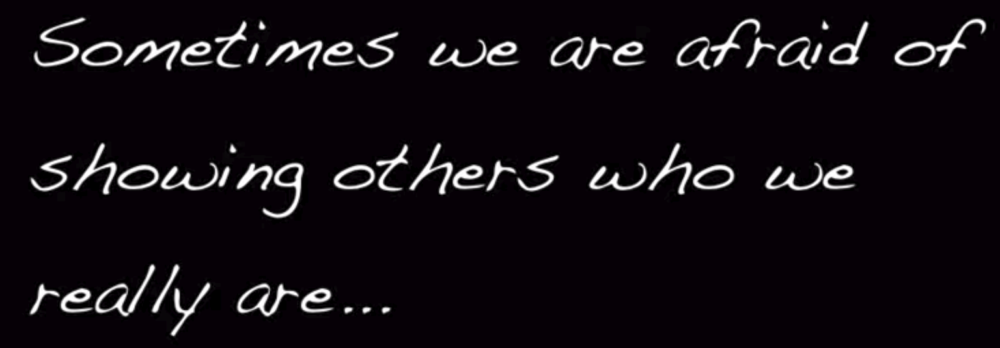

***
*我所分享之文章及程序等等皆免費，無版權，歡迎如實轉載與分享，只須標明出處即可！感恩同行有你！* 
****
- [跳轉到博客目錄頁面](../../tableOfContent.md)<---[在線閱讀]&nbsp;&nbsp; &nbsp; &nbsp; &nbsp; &nbsp; &nbsp; &nbsp; &nbsp; &nbsp;&nbsp; &nbsp;   [本地] --->[*_點擊此查看html網頁格式_*](../../tableOfContent.html)&nbsp; &nbsp; [*_pdf格式_*](../../tableOfContent.md.pdf)
****

### 
特別推薦文章

- [ 鄧紫棋解解的小說——2507抬上帝入天坑 https://github.com/brianwchh/2507 ](https://github.com/brianwchh/worldofheart_v2/blob/main/md_and_html/%E9%84%A7%E7%B4%AB%E6%A3%8B%E8%A7%A3%E8%A7%A3%E7%9A%84%E5%B0%8F%E8%AA%AA%E2%80%94%E2%80%942507%E6%8A%AC%E4%B8%8A%E5%B8%9D%E5%85%A5%E5%A4%A9%E5%9D%91.md)<---[點擊此前往github在線閱讀]&nbsp;&nbsp;  [本地] --->[*_點擊此查看html網頁格式_*](../../md_and_html/鄧紫棋解解的小說——2507抬上帝入天坑.html)&nbsp; &nbsp; [*_pdf格式_*](../../md_and_html/鄧紫棋解解的小說——2507抬上帝入天坑.md.pdf) 

- [ 心學心解 ](https://github.com/brianwchh/worldofheart_v2/blob/main/md_and_html/%E5%BF%83%E5%AD%B8%E6%96%B0%E8%A7%A3.md)<---[點擊此前往github在線閱讀]&nbsp;&nbsp; &nbsp;    [本地] --->[*_點擊此查看html網頁格式_*](../../md_and_html/心學新解.html)&nbsp; &nbsp; [*_pdf格式_*](../../md_and_html/心學新解.md.pdf) 

- [無眠月照無情門 . 失去自由的歌手](https://github.com/brianwchh/worldofheart_v2/blob/main/md_and_html/%E7%84%A1%E7%9C%A0%E6%9C%88%E7%85%A7%E7%84%A1%E6%83%85%E9%96%80.md) <---[點擊此前往github在線閱讀] &nbsp;&nbsp;&nbsp;&nbsp;&nbsp;&nbsp;&nbsp;&nbsp; 本地模式---> &nbsp;[html網頁版](../../md_and_html/無眠月照無情門.html) &nbsp;&nbsp;&nbsp; [pdf版本](../../md_and_html/無眠月照無情門.md.pdf) 

    
&nbsp; &nbsp; &nbsp; &nbsp; &nbsp; &nbsp; &nbsp; &nbsp; &nbsp; &nbsp; &nbsp; &nbsp; 西子  世人皆唱東坡詞，無人知我歌中淚。 胭脂淚痕君不見，肚藏淚酒君不知。 法律珠鍊人中鳳，舞臺深處天牢夢。 鍍金屠門千豬過，三寸魷魚萬人舔。 君入西子渡津口，她閱君腦千秋雪。

    
- [心世界(world of heart)](https://github.com/brianwchh/worldofheart_v2) <---[點擊此前往github在線閱讀]  https://github.com/brianwchh/worldofheart_v2 

   

****

 

# ****
我們其實不是人
****

&nbsp;&nbsp;&nbsp;&nbsp;&nbsp;&nbsp;&nbsp;&nbsp;&nbsp;&nbsp;&nbsp;&nbsp;&nbsp;&nbsp;&nbsp;&nbsp;&nbsp;&nbsp;&nbsp;&nbsp; 阿柄

 

 

迷糊

近來常覺卿在旁，   
昨夜迷糊關電腦。  
猶似細時喚兒眠，  
只憐常伴卻不見。  
 

 

 

什麼是人？  

先別談身體自由。在我們的認知里，人就是獨立的個體。何爲獨立，就是大腦的自由！   

可惜我們連大腦的自由都沒有！ 當你明白腦控，你就知道人是什麼東西了！  

我們其實是真的殭屍！ 我們的大腦是可以被操控的，包括你的情緒，情緒是內分泌的直接產物，能直接作用於松果體，從而催生退黑激素！催眠就是這樣實現的。而情緒也是一樣，只是，我們總以爲：你以爲的你以爲是你以爲的你以爲。

我們其實都是戴着無形腦控鐵鍊的殭屍！

當你連大腦的起碼自由都沒有的時候，恐怕你也會真覺得：人這東西其實跟牲畜沒啥區別。唯一的區別是，牲畜知道自己被鐵鍊牽着，而有點智商的東西卻忘記了自己是什麼東西！被牽着鼻子走，卻以爲是自己的意願！

 

 

***___  &nbsp; 。 ___***

 2023年3月7日 於韓國濟州島 &nbsp;&nbsp;&nbsp;&nbsp;&nbsp;&nbsp;&nbsp;&nbsp;&nbsp;&nbsp;&nbsp; 
 

 

 

